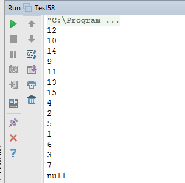

# 面试题 58：二叉树的下一个结点

##题目：给定一棵二叉树和其中的一个结点，如何找出中序遍历顺序的下一个结点？树中的结点除了有两个分别指向左右子结点的指针以外，还有一个指向父节点的指针。

###解题思路

如果一个结点有右子树，那么它的下一个结点就是它的右子树中的左子结点。也就是说右子结点出发一直沿着指向左子结点的指针，我们就能找到它的下一个结点。 

接着我们分析一个结点没有右子树的情形。如果结点是它父节点的左子结点，那么它的下一个结点就是它的父结点。 

如果一个结点既没有右子树，并且它还是它父结点的右子结点，这种情形就比较复杂。我们可以沿着指向父节点的指针一直向上遍历，直到找到一个是它父结点的左子结点的结点。如果这样的结点存在，那么这个结点的父结点就是我们要找的下一个结点。

###结点定义

```
private static class BinaryTreeNode {
    private int val;
    private BinaryTreeNode left;
    private BinaryTreeNode right;
    private BinaryTreeNode parent;
    public BinaryTreeNode() {
    }
    public BinaryTreeNode(int val) {
        this.val = val;
    }
    @Override
    public String toString() {
        return val + "";
    }
}
```

###代码实现

```
public class Test58 {
    private static class BinaryTreeNode {
        private int val;
        private BinaryTreeNode left;
        private BinaryTreeNode right;
        private BinaryTreeNode parent;
        public BinaryTreeNode() {
        }
        public BinaryTreeNode(int val) {
            this.val = val;
        }
        @Override
        public String toString() {
            return val + "";
        }
    }
    public static BinaryTreeNode getNext(BinaryTreeNode node) {
        if (node == null) {
            return null;
        }
        // 保存要查找的下一个节点
        BinaryTreeNode target = null;
        if (node.right != null) {
            target = node.right;
            while (target.left != null) {
                target = target.left;
            }
            return target;
        } else if (node.parent != null){
            target = node.parent;
            BinaryTreeNode cur = node;
            // 如果父新结点不为空，并且，子结点不是父结点的左孩子
            while (target != null && target.left != cur) {
                cur = target;
                target = target.parent;
            }
            return target;
        }
        return null;
    }
    private static void assemble(BinaryTreeNode node,
                                 BinaryTreeNode left,
                                 BinaryTreeNode right,
                                 BinaryTreeNode parent) {
        node.left = left;
        node.right = right;
        node.parent = parent;
    }
    public static void main(String[] args) {
        test01();
    }
    //                            1
    //                  2                   3
    //             4         5          6          7
    //          8     9   10   11   12   13    14   15
    public static void test01() {
        BinaryTreeNode n1 = new BinaryTreeNode(1); // 12
        BinaryTreeNode n2 = new BinaryTreeNode(2); // 10
        BinaryTreeNode n3 = new BinaryTreeNode(3); // 14
        BinaryTreeNode n4 = new BinaryTreeNode(4); // 9
        BinaryTreeNode n5 = new BinaryTreeNode(5); // 11
        BinaryTreeNode n6 = new BinaryTreeNode(6); // 13
        BinaryTreeNode n7 = new BinaryTreeNode(7); // 15
        BinaryTreeNode n8 = new BinaryTreeNode(8); // 4
        BinaryTreeNode n9 = new BinaryTreeNode(9); // 2
        BinaryTreeNode n10 = new BinaryTreeNode(10); // 5
        BinaryTreeNode n11 = new BinaryTreeNode(11); // 1
        BinaryTreeNode n12 = new BinaryTreeNode(12); // 6
        BinaryTreeNode n13 = new BinaryTreeNode(13); // 3
        BinaryTreeNode n14 = new BinaryTreeNode(14); // 7
        BinaryTreeNode n15 = new BinaryTreeNode(15); // null
        assemble(n1, n2, n3, null);
        assemble(n2, n4, n5, n1);
        assemble(n3, n6, n7, n1);
        assemble(n4, n8, n9, n2);
        assemble(n5, n10, n11, n2);
        assemble(n6, n12, n13, n3);
        assemble(n7, n14, n15, n3);
        assemble(n8, null, null, n4);
        assemble(n9, null, null, n4);
        assemble(n10, null, null, n5);
        assemble(n11, null, null, n5);
        assemble(n12, null, null, n6);
        assemble(n13, null, null, n6);
        assemble(n14, null, null, n7);
        assemble(n15, null, null, n7);
        System.out.println(getNext(n1));
        System.out.println(getNext(n2));
        System.out.println(getNext(n3));
        System.out.println(getNext(n4));
        System.out.println(getNext(n5));
        System.out.println(getNext(n6));
        System.out.println(getNext(n7));
        System.out.println(getNext(n8));
        System.out.println(getNext(n9));
        System.out.println(getNext(n10));
        System.out.println(getNext(n11));
        System.out.println(getNext(n12));
        System.out.println(getNext(n13));
        System.out.println(getNext(n14));
        System.out.println(getNext(n15));
    }
}
```

###运行结果

