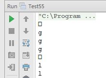

# 面试题 55：字符流中第一个不重复的字符

##题目：请实现一个函数用来找出字符流中第一个只出现一次的字符。

###举例说明

例如，当从字符流中只读出前两个字符“go”时，第一个只出现一次的字符是‘g’。当从该字符流中读出前六个字符“google”时，第一个只出现 1 次的字符是”l”。

###解题思路

字符只能一个接着一个从字符流中读出来。可以定义一个数据容器来保存字符在字符流中的位置。当一个字符第一次从字符流中读出来时，把它在字符流中的位置保存到数据容器里。当这个字符再次从字符流中被读出来时，那么它就不是只出现一次的字符，也就可以被忽略了。这时把它在数据容器里保存的值更新成一个特殊的值（比如负值）。 

为了尽可能高校地解决这个问题，需要在 O(1)时间内往容器里插入一个字符，以及更新一个字符对应的值。这个容器可以用哈希表来实现。用字符的 ASCII 码作为哈希表的键值，而把字符对应的位置作为哈希表的值。

###代码实现

```
public class Test55 {
    /**
     * 题目：请实现一个函数用来找出字符流中第一个只出现一次的字符。
     */
    private static class CharStatistics {
        // 出现一次的标识
        private int index = 0;
        private int[] occurrence = new int[256];
        public CharStatistics() {
            for (int i = 0; i < occurrence.length; i++) {
                occurrence[i] = -1;
            }
        }
        private void insert(char ch) {
            if (ch > 255) {
                throw new IllegalArgumentException( ch + "must be a ASCII char");
            }
            // 只出现一次
            if (occurrence[ch] == -1) {
                occurrence[ch] = index;
            } else {
                // 出现了两次
                occurrence[ch] = -2;
            }
            index++;
        }
        public char firstAppearingOnce(String data) {
            if (data == null) {
                throw new IllegalArgumentException(data);
            }
            for (int i = 0; i < data.length(); i++) {
                insert(data.charAt(i));
            }
            char ch = '\0';
            // 用于记录最小的索引，对应的就是第一个不重复的数字
            int minIndex = Integer.MAX_VALUE;
            for (int i = 0; i < occurrence.length; i++) {
                if (occurrence[i] >= 0 && occurrence[i] < minIndex) {
                    ch = (char) i;
                    minIndex = occurrence[i];
                }
            }
            return ch;
        }
    }
    public static void main(String[] args) {
        System.out.println(new CharStatistics().firstAppearingOnce("")); // '\0'
        System.out.println(new CharStatistics().firstAppearingOnce("g")); // 'g'
        System.out.println(new CharStatistics().firstAppearingOnce("go")); // 'g'
        System.out.println(new CharStatistics().firstAppearingOnce("goo")); // 'g'
        System.out.println(new CharStatistics().firstAppearingOnce("goog")); // '\0'
        System.out.println(new CharStatistics().firstAppearingOnce("googl")); // l
        System.out.println(new CharStatistics().firstAppearingOnce("google")); // l
    }
}
```

###运行结果

