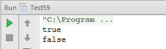

# 对称的二叉树

## 题目：请实现一个函数来判断一棵二叉树是不是对称的。如果一棵二叉树和它的镜像一样，那么它是对称的。

### 解题思路

通常我们有三种不同的二叉树遍历算法，即前序遍历、中序遍历和后序遍历。在这三种遍历算法中，都是先遍历左子结点再遍历右子结点。我们是否可以定义一种遍历算法，先遍历右子结点再遍历左子结点？比如我们针对前序遍历定义一种对称的遍历算法，即先遍历父节点，再遍历它的右子结点，最后遍历它的左子结点。 

我们发现可以用过比较二叉树的前序遍历序列和对称前序遍历序列来判断二叉树是不是对称的。如果两个序列一样，那么二叉树就是对称的。

### 结点定义

```
private static class BinaryTreeNode {
    private int val;
    private BinaryTreeNode left;
    private BinaryTreeNode right;
    public BinaryTreeNode() {
    }
    public BinaryTreeNode(int val) {
        this.val = val;
    }
    @Override
    public String toString() {
        return val + "";
    }
}
```

### 代码实现

```
public class Test59 {
    private static class BinaryTreeNode {
        private int val;
        private BinaryTreeNode left;
        private BinaryTreeNode right;
        public BinaryTreeNode() {
        }
        public BinaryTreeNode(int val) {
            this.val = val;
        }
        @Override
        public String toString() {
            return val + "";
        }
    }
    public static boolean isSymmetrical(BinaryTreeNode root) {
        return isSymmetrical(root, root);
    }
    private static boolean isSymmetrical(BinaryTreeNode left, BinaryTreeNode right) {
        if (left == null && right == null) {
            return true;
        }
        if (left == null || right == null) {
            return false;
        }
        if (left.val != right.val ) {
            return false;
        }
        return isSymmetrical(left.left, right.right) && isSymmetrical(left.right, right.left);
    }
    public static void main(String[] args) {
        test01();
        test02();
    }
    private static void assemble(BinaryTreeNode node,
                                 BinaryTreeNode left,
                                 BinaryTreeNode right) {
        node.left = left;
        node.right = right;
    }
    //                            1
    //                  2                   2
    //             4         6          6          4
    //          8     9   10   11   11     10   9     8
    public static void test01() {
        BinaryTreeNode n1 = new BinaryTreeNode(1);
        BinaryTreeNode n2 = new BinaryTreeNode(2);
        BinaryTreeNode n3 = new BinaryTreeNode(2);
        BinaryTreeNode n4 = new BinaryTreeNode(4);
        BinaryTreeNode n5 = new BinaryTreeNode(6);
        BinaryTreeNode n6 = new BinaryTreeNode(6);
        BinaryTreeNode n7 = new BinaryTreeNode(4);
        BinaryTreeNode n8 = new BinaryTreeNode(8);
        BinaryTreeNode n9 = new BinaryTreeNode(9);
        BinaryTreeNode n10 = new BinaryTreeNode(10);
        BinaryTreeNode n11 = new BinaryTreeNode(11);
        BinaryTreeNode n12 = new BinaryTreeNode(11);
        BinaryTreeNode n13 = new BinaryTreeNode(10);
        BinaryTreeNode n14 = new BinaryTreeNode(9);
        BinaryTreeNode n15 = new BinaryTreeNode(8);
        assemble(n1, n2, n3);
        assemble(n2, n4, n5);
        assemble(n3, n6, n7);
        assemble(n4, n8, n9);
        assemble(n5, n10, n11);
        assemble(n6, n12, n13);
        assemble(n7, n14, n15);
        assemble(n8, null, null);
        assemble(n9, null, null);
        assemble(n10, null, null);
        assemble(n11, null, null);
        assemble(n12, null, null);
        assemble(n13, null, null);
        assemble(n14, null, null);
        assemble(n15, null, null);
        System.out.println(isSymmetrical(n1));
    }
    //                            1
    //                  2                   2
    //             4         5          6          4
    //          8     9   10   11   11     10   9     8
    public static void test02() {
        BinaryTreeNode n1 = new BinaryTreeNode(1);
        BinaryTreeNode n2 = new BinaryTreeNode(2);
        BinaryTreeNode n3 = new BinaryTreeNode(2);
        BinaryTreeNode n4 = new BinaryTreeNode(4);
        BinaryTreeNode n5 = new BinaryTreeNode(5);
        BinaryTreeNode n6 = new BinaryTreeNode(6);
        BinaryTreeNode n7 = new BinaryTreeNode(4);
        BinaryTreeNode n8 = new BinaryTreeNode(8);
        BinaryTreeNode n9 = new BinaryTreeNode(9);
        BinaryTreeNode n10 = new BinaryTreeNode(10);
        BinaryTreeNode n11 = new BinaryTreeNode(11);
        BinaryTreeNode n12 = new BinaryTreeNode(11);
        BinaryTreeNode n13 = new BinaryTreeNode(10);
        BinaryTreeNode n14 = new BinaryTreeNode(9);
        BinaryTreeNode n15 = new BinaryTreeNode(8);
        assemble(n1, n2, n3);
        assemble(n2, n4, n5);
        assemble(n3, n6, n7);
        assemble(n4, n8, n9);
        assemble(n5, n10, n11);
        assemble(n6, n12, n13);
        assemble(n7, n14, n15);
        assemble(n8, null, null);
        assemble(n9, null, null);
        assemble(n10, null, null);
        assemble(n11, null, null);
        assemble(n12, null, null);
        assemble(n13, null, null);
        assemble(n14, null, null);
        assemble(n15, null, null);
        System.out.println(isSymmetrical(n1));
    }
}
```

### 运行结果

