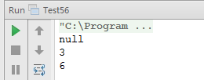

# 面试题 56：链表中环的入口结点

##题目：一个链表中包含环，如何找出环的入口结点？

###解题思路

可以用两个指针来解决这个问题。先定义两个指针 P1 和 P2 指向链表的头结点。如果链表中环有 n 个结点，指针 P1 在链表上向前移动 n 步，然后两个指针以相同的速度向前移动。当第二个指针指向环的入口结点时，第一个指针已经围绕着环走了一圈又回到了入口结点。 

剩下的问题就是如何得到环中结点的数目。我们在面试题 15 的第二个相关题目时用到了一快一慢的两个指针。如果两个指针相遇，表明链表中存在环。两个指针相遇的结点一定是在环中。可以从这个结点出发，一边继续向前移动一边计数，当再次回到这个结点时就可以得到环中结点数了。

###结点定义

```
    private static class ListNode {
        private int val;
        private ListNode next;
        public ListNode() {
        }
        public ListNode(int val) {
            this.val = val;
        }
        @Override
        public String toString() {
            return val +"";
        }
    }
```

###代码实现

```
public class Test56 {
    private static class ListNode {
        private int val;
        private ListNode next;
        public ListNode() {
        }
        public ListNode(int val) {
            this.val = val;
        }
        @Override
        public String toString() {
            return val +"";
        }
    }
    public static ListNode meetingNode(ListNode head) {
        ListNode fast = head;
        ListNode slow = head;
        while (fast != null && fast.next != null) {
            fast = fast.next.next;
            slow = slow.next;
            if (fast == slow) {
                break;
            }
        }
        // 链表中没有环
        if (fast == null || fast.next == null) {
            return null;
        }
        // fast重新指向第一个结点
        fast = head;
        while (fast != slow) {
            fast = fast.next;
            slow = slow.next;
        }
        return fast;
    }
    public static void main(String[] args) {
        test01();
        test02();
        test03();
    }
    // 1->2->3->4->5->6
    private static void test01() {
        ListNode n1 = new ListNode(1);
        ListNode n2 = new ListNode(2);
        ListNode n3 = new ListNode(3);
        ListNode n4 = new ListNode(4);
        ListNode n5 = new ListNode(5);
        ListNode n6 = new ListNode(6);
        n1.next = n2;
        n2.next = n3;
        n3.next = n4;
        n4.next = n5;
        n5.next = n6;
        System.out.println(meetingNode(n1));
    }
    // 1->2->3->4->5->6
    //       ^        |
    //       |        |
    //       +--------+
    private static void test02() {
        ListNode n1 = new ListNode(1);
        ListNode n2 = new ListNode(2);
        ListNode n3 = new ListNode(3);
        ListNode n4 = new ListNode(4);
        ListNode n5 = new ListNode(5);
        ListNode n6 = new ListNode(6);
        n1.next = n2;
        n2.next = n3;
        n3.next = n4;
        n4.next = n5;
        n5.next = n6;
        n6.next = n3;
        System.out.println(meetingNode(n1));
    }
    // 1->2->3->4->5->6 <-+
    //                |   |
    //                +---+
    private static void test03() {
        ListNode n1 = new ListNode(1);
        ListNode n2 = new ListNode(2);
        ListNode n3 = new ListNode(3);
        ListNode n4 = new ListNode(4);
        ListNode n5 = new ListNode(5);
        ListNode n6 = new ListNode(6);
        n1.next = n2;
        n2.next = n3;
        n3.next = n4;
        n4.next = n5;
        n5.next = n6;
        n6.next = n6;
        System.out.println(meetingNode(n1));
    }
}
```

###运行结果



