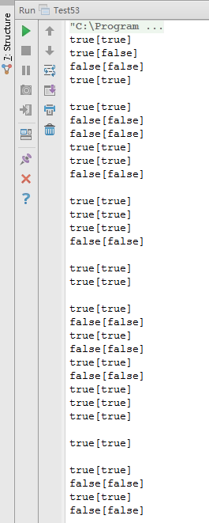

# 正则表达式匹配

## 题目：请实现一个函数用来匹配包含‘.’和‘*’的正则表达式。模式中的字符’.’表示任意一个字符，而‘*’表示它前面的字符可以出现任意次（含0次）。本题中，匹配是指字符串的所有字符匹配整个模式。例如，字符串“aaa”与模式“a.a”和“ab*ac*a”匹配，但与“aa.a”及“ab*a”均不匹配。

### 题目解析

每次从字符串里拿出一个字符和模式中的字符去匹配。先来分析如何匹配一个字符。如果模式中的字符 ch是‘.’，那么它可以匹配字符串中的任意字符。如果模式中的字符 ch不是’.’而且字符串中的字符也是 ch，那么他们相互匹配。当字符串中的字符和模式中的字符相匹配时，接着匹配后面的字符。

相对而言当模式中的第二个字符不是‘*’时问题要简单很多。如果字符串中的第一个字符和模式中的第一个字符相匹配，那么在字符串和模式上都向后移动一个字符，然后匹配剩余的字符串和模式。如果字符串中的第一个字符和模式中的第一个字符不相匹配，则直接返回 false。 

当模式中的第二个字符是‘*’时问题要复杂一些，因为可能有多种不同的匹配方式。一个选择是在模式上向后移动两个字符。这相当于‘*’和它面前的字符被忽略掉了，因为‘*’可以匹配字符串中 0 个字符。如果模式中的第一个字符和字符串中的第一个字符相匹配时，则在字符串向后移动一个字符，而在模式上有两个选择：我们可以在模式上向后移动两个字符，也可以保持模式不变。

### 代码实现

```
public class Test53 {
    /**
     * 题目：请实现一个函数用来匹配包含‘.’和‘*’的正则表达式。模式中的字符'.'表示任意一个字符，
     * 而‘*’表示它前面的字符可以出现任意次（含0次）。本题中，匹配是指字符串的所有字符匹配整个模式。
     *
     * @param input
     * @param pattern
     * @return
     */
    public static boolean match(String input, String pattern) {
        if (input == null || pattern == null) {
            return false;
        }
        return matchCore(input, 0, pattern, 0);
    }
    private static boolean matchCore(String input, int i, String pattern, int p) {
        // 匹配串和模式串都到达尾，说明成功匹配
        if (i >= input.length() && p >= pattern.length()) {
            return true;
        }
        // 只有模式串到达结尾，说明匹配失败
        if (i != input.length() && p >= pattern.length()) {
            return false;
        }
        // 模式串未结束，匹配串有可能结束有可能未结束
        // p位置的下一个字符中为*号
        if (p + 1 < pattern.length() && pattern.charAt(p + 1) == '*') {
            // 匹配串已经结束
            if (i >= input.length()) {
                return matchCore(input, i, pattern, p + 2);
            }
            // 匹配串还没有结束
            else {
                if (pattern.charAt(p) == input.charAt(i) || pattern.charAt(p) == '.') {
                    return
                            // 匹配串向后移动一个位置，模式串向后移动两个位置
                            matchCore(input, i + 1, pattern, p + 2)
                                    // 匹配串向后移动一个位置，模式串不移动
                                    || matchCore(input, i + 1, pattern, p)
                                    // 匹配串不移动，模式串向后移动两个位置
                                    || matchCore(input, i, pattern, p + 2);
                } else {
                    return matchCore(input, i, pattern, p + 2);
                }
            }
        }
        //
        // 匹配串已经结束
        if (i >= input.length()) {
            return false;
        }
        // 匹配串还没有结束
        else {
            if (input.charAt(i) == pattern.charAt(p) || pattern.charAt(p) == '.') {
                return matchCore(input, i + 1, pattern, p + 1);
            }
        }
        return false;
    }
    public static void main(String[] args) {
        System.out.println(match("", "") + "[" + true + "]");
        System.out.println(match("", ".*") + "[" + false + "]");
        System.out.println(match("", ".") + "[" + false + "]");
        System.out.println(match("", "c*") + "[" + true + "]");
        System.out.println();
        System.out.println(match("a", ".*") + "[" + true + "]");
        System.out.println(match("a", "a.") + "[" + false + "]");
        System.out.println(match("a", "") + "[" + false + "]");
        System.out.println(match("a", ".") + "[" + true + "]");
        System.out.println(match("a", "ab*") + "[" + true + "]");
        System.out.println(match("a", "ab*a") + "[" + false + "]");
        System.out.println();
        System.out.println(match("aa", "aa") + "[" + true + "]");
        System.out.println(match("aa", "a*") + "[" + true + "]");
        System.out.println(match("aa", ".*") + "[" + true + "]");
        System.out.println(match("aa", ".") + "[" + false + "]");
        System.out.println();
        System.out.println(match("ab", ".*") + "[" + true + "]");
        System.out.println(match("ab", ".*") + "[" + true + "]");
        System.out.println();
        System.out.println(match("aaa", "aa*") + "[" + true + "]");
        System.out.println(match("aaa", "aa.a") + "[" + false + "]");
        System.out.println(match("aaa", "a.a") + "[" + true + "]");
        System.out.println(match("aaa", ".a") + "[" + false + "]");
        System.out.println(match("aaa", "a*a") + "[" + true + "]");
        System.out.println(match("aaa", "ab*a") + "[" + false + "]");
        System.out.println(match("aaa", "ab*ac*a") + "[" + true + "]");
        System.out.println(match("aaa", "ab*a*c*a") + "[" + true + "]");
        System.out.println(match("aaa", ".*") + "[" + true + "]");
        System.out.println();
        System.out.println(match("aab", "c*a*b") + "[" + true + "]");
        System.out.println();
        System.out.println(match("aaca", "ab*a*c*a") + "[" + true + "]");
        System.out.println(match("aaba", "ab*a*c*a") + "[" + false + "]");
        System.out.println(match("bbbba", ".*a*a") + "[" + true + "]");
        System.out.println(match("bcbbabab", ".*a*a") + "[" + false + "]");
    }
}
```

### 运行结果

