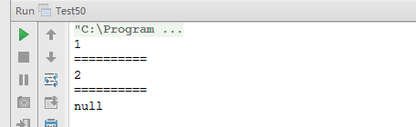

# 面试题 50：树中两个结点的最低公共祖先

##题目：求树中两个结点的最低公共祖先，此树不是二叉树，并且没有指向父节点的指针。

###树的结点定义

```
private static class TreeNode {
    int val;
    List<TreeNode> children = new LinkedList<>();
    public TreeNode() {
    }
    public TreeNode(int val) {
        this.val = val;
    }
    @Override
    public String toString() {
        return  val + "";
    }
}
```

###题目解析

假设还是输入结点 F 和 H。 


我们首先得到一条从根结点到树中某一结点的路径，这就要求在遍历的时候，有一个辅助内存来保存路径。比如我们用前序遍历的方法来得到从根结点到 H 的路径的过程是这样的：（ 1 ）遍历到 A，把 A 存放到路径中去，路径中只有一个结点 A；( 2 ）遍历到 B，把 B 存到路径中去，此时路径为 A->B; ( 3 ）遍历到 D，把 D 存放到路径中去，此，时路径为 A->B->D；( 4 ）：遍历到 F，把 F 存放到路径中去，此时路径为 A->B->D->F；( 5) F 已经没有子结点了，因此这条路径不可能到这结点 H。 把 F 从路径中删除，变成 A->B->D; ( 6 ）遍历 G。 和结点F 一样，这条路径也不能到达 H。边历完 G 之后，路径仍然是 A->B->D； ( 7 ）由于 D 的所有子结点都遍历过了，不可能到这结点 H，因此 D 不在从 A 到 H 的路径中，把 D 从路径中删除，变成 A->B； ( 8 ）遥历 E，把 E 加入到路径中，此时路径变成 A->B->E， ( 9 ）遍历 H，已经到达目标给点， A->B->E 就是从根结点开始到达 H 必须经过的路径。 

同样，我们也可以得到从根结点开始到达 F 必须经过的路径是 A->B。接着，我们求出这两个路径的最后公共结点，也就是 B。B 这个结点也是 F 和 H 的最低公共祖先． 

为了得到从根结点开始到输入的两个结点的两条路径，需要追历两次树，每边历一次的时间复杂度是 O(n）。得到的两条路径的长度在最差情况时是 0（通常情况丁两条路径的长度是 O(logn)。

注意：可以在只遍历树一次就找到两个结点的路径，这部分留给读者自己去完成。

###代码实现

```
import java.util.Iterator;
import java.util.LinkedList;
import java.util.List;
public class Test50 {
    /**
     * 树的结点定义
     */
    private static class TreeNode {
        int val;
        List<TreeNode> children = new LinkedList<>();
        public TreeNode() {
        }
        public TreeNode(int val) {
            this.val = val;
        }
        @Override
        public String toString() {
            return val + "";
        }
    }
    /**
     * 找结点的路径
     *
     * @param root   根结点
     * @param target 目标结点
     * @param path   从根结点到目标结点的路径
     */
    public static void getNodePath(TreeNode root, TreeNode target, List<TreeNode> path) {
        if (root == null) {
            return;
        }
        // 添加当前结点
        path.add(root);
        List<TreeNode> children = root.children;
        // 处理子结点
        for (TreeNode node : children) {
            if (node == target) {
                path.add(node);
                return;
            } else {
                getNodePath(node, target, path);
            }
        }
        // 现场还原
        path.remove(path.size() - 1);
    }
    /**
     * 找两个路径中的最后一个共同的结点
     *
     * @param p1 路径1
     * @param p2 路径2
     * @return 共同的结点，没有返回null
     */
    public static TreeNode getLastCommonNode(List<TreeNode> p1, List<TreeNode> p2) {
        Iterator<TreeNode> ite1 = p1.iterator();
        Iterator<TreeNode> ite2 = p2.iterator();
        TreeNode last = null;
        while (ite1.hasNext() && ite2.hasNext()) {
            TreeNode tmp = ite1.next();
            if (tmp == ite2.next()) {
                last = tmp;
            }
        }
        return last;
    }
    /**
     * 找树中两个结点的最低公共祖先
     * @param root 树的根结点
     * @param p1 结点1
     * @param p2 结点2
     * @return 公共结点，没有返回null
     */
    public static TreeNode getLastCommonParent(TreeNode root, TreeNode p1, TreeNode p2) {
        if (root == null || p1 == null || p2 == null) {
            return null;
        }
        List<TreeNode> path1 = new LinkedList<>();
        getNodePath(root, p1, path1);
        List<TreeNode> path2 = new LinkedList<>();
        getNodePath(root, p2, path2);
        return getLastCommonNode(path1, path2);
    }
    public static void main(String[] args) {
        test01();
        System.out.println("==========");
        test02();
        System.out.println("==========");
        test03();
    }
    // 形状普通的树
    //             1
    //           /   \
    //         2      3
    //        /         \
    //      4            5
    //     / \        /  |  \
    //    6   7      8   9  10
    public static void test01() {
        TreeNode n1 = new TreeNode(1);
        TreeNode n2 = new TreeNode(2);
        TreeNode n3 = new TreeNode(3);
        TreeNode n4 = new TreeNode(4);
        TreeNode n5 = new TreeNode(5);
        TreeNode n6 = new TreeNode(6);
        TreeNode n7 = new TreeNode(7);
        TreeNode n8 = new TreeNode(8);
        TreeNode n9 = new TreeNode(9);
        TreeNode n10 = new TreeNode(10);
        n1.children.add(n2);
        n1.children.add(n3);
        n2.children.add(n4);
        n4.children.add(n6);
        n4.children.add(n7);
        n3.children.add(n5);
        n5.children.add(n8);
        n5.children.add(n9);
        n5.children.add(n10);
        System.out.println(getLastCommonParent(n1, n6, n8));
    }
    // 树退化成一个链表
    //               1
    //              /
    //             2
    //            /
    //           3
    //          /
    //         4
    //        /
    //       5
    private static void test02() {
        TreeNode n1 = new TreeNode(1);
        TreeNode n2 = new TreeNode(2);
        TreeNode n3 = new TreeNode(3);
        TreeNode n4 = new TreeNode(4);
        TreeNode n5 = new TreeNode(5);
        n1.children.add(n2);
        n2.children.add(n3);
        n3.children.add(n4);
        n4.children.add(n5);
        System.out.println(getLastCommonParent(n1, n4, n5));
    }
    // 树退化成一个链表，一个结点不在树中
    //               1
    //              /
    //             2
    //            /
    //           3
    //          /
    //         4
    //        /
    //       5
    private static void test03() {
        TreeNode n1 = new TreeNode(1);
        TreeNode n2 = new TreeNode(2);
        TreeNode n3 = new TreeNode(3);
        TreeNode n4 = new TreeNode(4);
        TreeNode n5 = new TreeNode(5);
        TreeNode n6 = new TreeNode(6);
        n1.children.add(n2);
        n2.children.add(n3);
        n3.children.add(n4);
        n4.children.add(n5);
        System.out.println(getLastCommonParent(n1, n5, n6));
    }
}
```
###运行结果

