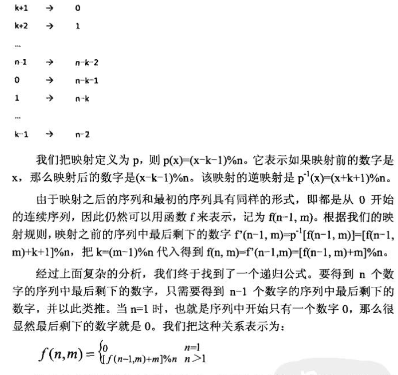
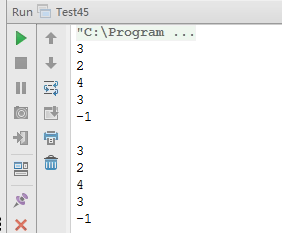

# 面试题 45：圆圈中最后剩下的数字(约瑟夫环问题)

##题目：0, 1, … , n-1 这 n 个数字排成一个圈圈，从数字 0 开始每次从圆圏里删除第 m 个数字。求出这个圈圈里剩下的最后一个数字。

###解题思路

####第一种：经典的解法， 用环形链表模拟圆圈。 

创建一个总共有 n 个结点的环形链表，然后每次在这个链表中删除第 m 个结点。

###代码实现

```
public static int lastRemaining(int n, int m) {
    if (n < 1 || m < 1) {
        return -1;
    }
    List<Integer> list = new LinkedList<>();
    for (int i = 0; i < n; i++) {
        list.add(i);
    }
    // 要删除元素的位置
    int idx = 0;
    // 开始计数的位置
    int start = 0;
    while (list.size() > 1) {
        // 只要移动m-1次就可以移动到下一个要删除的元素上
        for (int i = 1; i < m; i++) {
            idx = (idx + 1) % list.size(); // 【A】
        }
        list.remove(idx);
        // 确保idx指向每一轮的第一个位置
        // 下面的可以不用，【A】已经可以保证其正确性了，可以分析n=6，m=6的第一次删除情况
    //  if (idx == list.size()) {
    //      idx = 0;
    //  }
    }
    return list.get(0);
}
```

####第二种：分析法 

首先我们定义一个关于 n 和 m 的方程町矶时，表示每次在 n 个数字 0，1， … ，n-1中每次删除第 m 个数字最后剩下的数字。
 
在这 n个数字中， 第一个被删除的数字是(m-1)%n。为了简单起见，我们把(m- 1)%n 记为 k，那么删除k之后剩下的 n-1 个数字为 0，1，… ，k-1，k+1，… ，n-1，并且下一次删除从数字 k+1 开始计数。相当于在剩下的序列中， k+1 排在最前面，从而形成 k+1，... ，n- 1，0，I，… ，k-1 。该序列最后剩下的数字也应该是关于 n 和 m 的函数。由于这个序列的规律和前面最初的序列不一样（最初的序列是从 0 开始的连续序列），因此该函数不同于前面的函数，记为 f’(n-1,m)。最初序列最后剩下的数字 f(n, m）一定是删除一个数字之后的序列最后剩下的数字，即 f(n, m)=f’(n-1, m）。 

接下来我们把剩下的这 n-1 个数字的序列 k-1， …，n-1，0，1，… ，k-1 做一个映射，映射的结果是形成一个从 0 到 n-2 的序列： 
　　 


###代码实现

```
public static int lastRemaining2(int n, int m) {
    if (n < 1 || m < 1) {
        return -1;
    }
    int last = 0;
    for (int i = 2; i <=n ; i++) {
        last = (last + m)%i;
    }
    return last;
}
```

###完整代码

```
import java.util.LinkedList;
import java.util.List;
public class Test45 {
    public static int lastRemaining(int n, int m) {
        if (n < 1 || m < 1) {
            return -1;
        }
        List<Integer> list = new LinkedList<>();
        for (int i = 0; i < n; i++) {
            list.add(i);
        }
        // 要删除元素的位置
        int idx = 0;
        // 开始计数的位置
        int start = 0;
        while (list.size() > 1) {
            // 只要移动m-1次就可以移动到下一个要删除的元素上
            for (int i = 1; i < m; i++) {
                idx = (idx + 1) % list.size(); // 【A】
            }
            list.remove(idx);
            // 确保idx指向每一轮的第一个位置
            // 下面的可以不用，【A】已经可以保证其正确性了，可以分析n=6，m=6的第一次删除情况
        //  if (idx == list.size()) {
        //      idx = 0;
        //  }
        }
        return list.get(0);
    }
    public static int lastRemaining2(int n, int m) {
        if (n < 1 || m < 1) {
            return -1;
        }
        int last = 0;
        for (int i = 2; i <=n ; i++) {
            last = (last + m)%i;
        }
        return last;
    }
    public static void main(String[] args) {
        test01();
        System.out.println();
        test02();
    }
    private static void test01() {
        System.out.println(lastRemaining(5, 3)); // 最后余下3
        System.out.println(lastRemaining(5, 2)); // 最后余下2
        System.out.println(lastRemaining(6, 7)); // 最后余下4
        System.out.println(lastRemaining(6, 6)); // 最后余下3
        System.out.println(lastRemaining(0, 0)); // 最后余下-1
    }
    private static void test02() {
        System.out.println(lastRemaining2(5, 3)); // 最后余下3
        System.out.println(lastRemaining2(5, 2)); // 最后余下2
        System.out.println(lastRemaining2(6, 7)); // 最后余下4
        System.out.println(lastRemaining2(6, 6)); // 最后余下3
        System.out.println(lastRemaining2(0, 0)); // 最后余下-1
    }
}
```

###运行结果

