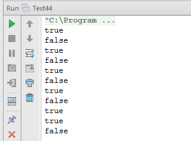

# 扑克牌的顺子

## 题目：从扑克牌中随机抽 5 张牌，判断是不是一个顺子， 即这 5 张牌是不是连续的。2～10 为数字本身， A 为 1。 J 为 11、Q 为 12、 为 13。小王可以看成任意数字。

### 解题思路

我们可以把 5 张牌看成由 5 个数字组成的数组。大、小王是特殊的数字，我们不妨把它们都定义为 0，这样就能和其他扑克牌区分开来了。 

接下来我们分析怎样判断 5 个数字是不是连续的，最直观的方法是把数组排序。值得注意的是，由于 0 可以当成任意数字，我们可以用 0 去补满数组中的空缺。如果排序之后的数组不是连续的，即相邻的两个数字相隔若干个数字，但只要我们有足够的。可以补满这两个数字的空缺，这个数组实际上还是连续的。举个例子，数组排序之后为{0，1，3，4，5}在 1 和 3 之间空缺了一个 2，刚好我们有一个 0，也就是我们可以把它当成 2 去填补这个空缺。 

于是我们需要做 3 件事情： 首先把数组排序，再统计数组中 0 的个数，最后统计排序之后的数组中相邻数字之间的空缺总数。如果空缺的总数小于或者等于 0 的个数，那么这个数组就是连续的：反之则不连续。 

最后，我们还需要注意一点： 如果数组中的非 0 数字重复出现，则该数组不是连续的。换成扑克牌的描述方式就是如果一副牌里含有对子，则不可能是顺子。

### 算法实现

```
import java.util.Arrays;
public class Test44 {
    /**
     * 题目：从扑克牌中随机抽5张牌，判断是不是一个顺子， 即这5张牌是不是连续的。
     * 2～10为数字本身， A为1。 J为11、Q为12、 为13。小王可以看成任意数字。
     * @param numbers
     * @return
     */
    public static boolean isContinuous(int[] numbers) {
        if (numbers == null || numbers.length != 5) {
            return false;
        }
        // 对元素进行排序
        Arrays.sort(numbers);
        int numberOfZero = 0;
        int numberOfGap = 0;
        for (int i = 0; i < numbers.length && numbers[i] == 0; i++) {
            numberOfZero++;
        }
        // 第一个非0元素的位置
        int small = numberOfZero;
        int big = small + 1;
        while (big < numbers.length) {
            if (numbers[small] == numbers[big]) {
                return false;
            }
            numberOfGap += (numbers[big] - numbers[small] - 1);
            small = big;
            big++;
        }
        return numberOfGap <= numberOfZero;
    }
    public static void main(String[] args) {
        int[] numbers1 = {1, 3, 2, 5, 4};
        System.out.println(isContinuous(numbers1));
        int[] numbers2 = {1, 3, 2, 6, 4};
        System.out.println(isContinuous(numbers2));
        int[] numbers3 = {0, 3, 2, 6, 4};
        System.out.println(isContinuous(numbers3));
        int[] numbers4 = {0, 3, 1, 6, 4};
        System.out.println(isContinuous(numbers4));
        int[] numbers5 = {1, 3, 0, 5, 0};
        System.out.println(isContinuous(numbers5));
        int[] numbers6 = {1, 3, 0, 7, 0};
        System.out.println(isContinuous(numbers6));
        int[] numbers7 = {1, 0, 0, 5, 0};
        System.out.println(isContinuous(numbers7));
        int[] numbers8 = {1, 0, 0, 7, 0};
        System.out.println(isContinuous(numbers8));
        int[] numbers9 = {3, 0, 0, 0, 0};
        System.out.println(isContinuous(numbers9));
        int[] numbers10 = {0, 0, 0, 0, 0};
        System.out.println(isContinuous(numbers10));
        int[] numbers11 = {1, 0, 0, 1, 0};
        System.out.println(isContinuous(numbers11));
    }
}
```

### 运行结果

