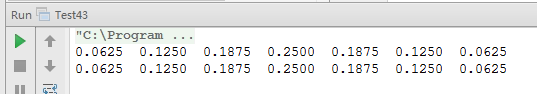

# 面试题 43:n 个锻子的点数

##题目：把 n 个骰子扔在地上，所有骰子朝上一面的点数之和为 s。输入 n，打印出 s 的所有可能的值出现的概率。

###解题思路

####解法一：基于通归求解，时间效率不够高。

先把 n 个骰子分为两堆：第一堆只有一个，另一个有 n-1 个。单独的那一个有可能出现从 1 到 6 的点数。我们需要计算从 1 到 6 的每一种点数和剩下的 n-1 个骰子来计算点数和。接下来把剩下的 n-1 个骰子还是分成两堆，第一堆只有一个， 第二堆有 n-2 个。我们把上一轮那个单独骰子的点数和这一轮单独骰子的点数相加， 再和剩下的 n-2 个骰子来计算点数和。分析到这里，我们不难发现这是一种递归的思路，递归结束的条件就是最后只剩下一个骰子。 

我们可以定义一个长度为“6n-n+1”的数组， 和为 s 的点数出现的次数保存到数组第 s-n 个元素里。

####解法二：基于循环求解，时间性能好

我们可以考虑用两个数组来存储骰子点数的每一个总数出现的次数。在一次循环中， 第一个数组中的第 n 个数字表示骰子和为 n 出现的次数。在下一循环中，我们加上一个新的骰子，此时和为 n 的骰子出现的次数应该等于上一次循环中骰子点数和为 n-1 、n-2 、n-3 、n-4, n-5 与 n-6 的次数的总和，所以我们把另一个数组的第 n 个数字设为前一个数组对应的第 n-1 、n-2 、n-3 、n-4、n-5 与 n-6 之和。

###代码实现

```
public class Test43 {
    /**
     * 基于通归求解
     *
     * @param number 色子个数
     * @param max    色子的最大值
     */
    public static void printProbability(int number, int max) {
        if (number < 1 || max < 1) {
            return;
        }
        int maxSum = number * max;
        int[] probabilities = new int[maxSum - number + 1];
        probability(number, probabilities, max);
        double total = 1;
        for (int i = 0; i < number; i++) {
            total *= max;
        }
        for (int i = number; i <= maxSum; i++) {
            double ratio = probabilities[i - number] / total;
            System.out.printf("%-8.4f", ratio);
        }
        System.out.println();
    }
    /**
     * @param number        色子个数
     * @param probabilities 不同色子数出现次数的计数数组
     * @param max           色子的最大值
     */
    private static void probability(int number, int[] probabilities, int max) {
        for (int i = 1; i <= max; i++) {
            probability(number, number, i, probabilities, max);
        }
    }
    /**
     * @param original      总的色子数
     * @param current       当前处理的是第几个
     * @param sum           已经前面的色子数和
     * @param probabilities 不同色子数出现次数的计数数组
     * @param max           色子的最大值
     */
    private static void probability(int original, int current, int sum, int[] probabilities, int max) {
        if (current == 1) {
            probabilities[sum - original]++;
        } else {
            for (int i = 1; i <= max; i++) {
                probability(original, current - 1, i + sum, probabilities, max);
            }
        }
    }
    /**
     * 基于循环求解
     * @param number 色子个数
     * @param max    色子的最大值
     */
    public static void printProbability2(int number, int max) {
        if (number < 1 || max < 1) {
            return;
        }
        int[][] probabilities = new int[2][max * number + 1];
        // 数据初始化
        for (int i = 0; i < max * number + 1; i++) {
            probabilities[0][i] = 0;
            probabilities[1][i] = 0;
        }
        // 标记当前要使用的是第0个数组还是第1个数组
        int flag = 0;
        // 抛出一个骰子时出现的各种情况
        for (int i = 1; i <= max; i++) {
            probabilities[flag][i] = 1;
        }
        // 抛出其它骰子
        for (int k = 2; k <= number; k++) {
            // 如果抛出了k个骰子，那么和为[0, k-1]的出现次数为0
            for (int i = 0; i < k; i++) {
                probabilities[1 - flag][i] = 0;
            }
            // 抛出k个骰子，所有和的可能
            for (int i = k; i <= max * k; i++) {
                probabilities[1 - flag][i] = 0;
                // 每个骰子的出现的所有可能的点数
                for (int j = 1; j <= i && j <= max; j++) {
                    // 统计出和为i的点数出现的次数
                    probabilities[1 - flag][i] += probabilities[flag][i - j];
                }
            }
            flag = 1 - flag;
        }
        double total = 1;
        for (int i = 0; i < number; i++) {
            total *= max;
        }
        int maxSum = number * max;
        for (int i = number; i <= maxSum; i++) {
            double ratio = probabilities[flag][i] / total;
            System.out.printf("%-8.4f", ratio);
        }
        System.out.println();
    }
    public static void main(String[] args) {
        test01();
        test02();
    }
    private static void test01() {
        printProbability(2, 4);
    }
    private static void test02() {
        printProbability2(2, 4);
    }
}
```

###运行结果

