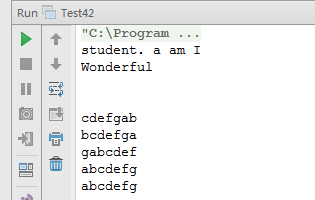

# 翻转单词顺序 vs 左旋转字符串

## 题目一：输入一个英文句子，翻转句子中单词的顺序，但单词内字啊的顺序不变。为简单起见，标点符号和普通字母一样处理。

### 举例说明

例如输入字符串”I am a student. ”，则输出”student. a am I”。

### 解题思路

第一步翻转句子中所有的字符。比如翻转“I am a student. ”中所有的字符得到”.tneduts a m a I”，此时不但翻转了句子中单词的顺序，连单词内的字符顺序也被翻转了。第二步再翻转每个单词中字符的顺序，就得到了”student. a am I”。这正是符合题目要求的输出。

### 代码实现

```
/**
 * 将data中start到end之间的数字反转
 *
 * @param data
 * @param start
 * @param end
 */
public static void reverse(char[] data, int start, int end) {
    if (data == null || data.length < 1 || start < 0 || end > data.length || start > end) {
        return;
    }
    while (start < end) {
        char tmp = data[start];
        data[start] = data[end];
        data[end] = tmp;
        start++;
        end--;
    }
}
/**
 * 题目一：输入一个英文句子，翻转句子中单词的顺序，但单词内字啊的顺序不变。
 * 为简单起见，标点符号和普通字母一样处理。
 *
 * @param data
 * @return
 */
public static char[] reverseSentence(char[] data) {
    if (data == null || data.length < 1) {
        return data;
    }
    reverse(data, 0, data.length - 1);
    int start = 0;
    int end = 0;
    while (start < data.length) {
        if (data[start] == ' ') {
            start++;
            end++;
        } else if (end == data.length || data[end] == ' ') {
            reverse(data, start, end - 1);
            end++;
            start = end;
        } else {
            end++;
        }
    }
    return data;
}
```

## 题目二：字符串的左旋转操作是把字符串前面的若干个字符转移到字符串的尾部。请定义一个函数实现字符串左旋转操作的功能。

### 举例说明

比如输入字符串”abcefg”和数字 2，该函数将返回左旋转 2 位得到的结”cdefab”。

### 解题思路

以”abcdefg”为例，我们可以把它分为两部分。由于想把它的前两个字符移到后面，我们就把前两个字符分到第一部分，把后面的所有字符都分到第二部分。我们先分别翻转这两部分，于是就得到”bagfedc”。接下来我们再翻转整个字符串， 得到的”cde 也 ab”同 lj 好就是把原始字符串左旋转 2 位的结果。

### 代码实现

```
/**
 * 题目二：字符串的左旋转操作是把字符串前面的若干个字符转移到字符串的尾部。
 * 请定义一个函数实现字符串左旋转操作的功能。
 * @param data
 * @param n
 * @return
 */
public static char[] leftRotateString(char[] data, int n) {
    if (data == null || n < 0 || n > data.length) {
        return data;
    }
    reverse(data, 0, data.length - 1);
    reverse(data, 0, data.length - n - 1);
    reverse(data, data.length - n, data.length - 1);
    return data;
}
```

### 完整代码

```
public class Test42 {
    /**
     * 将data中start到end之间的数字反转
     *
     * @param data
     * @param start
     * @param end
     */
    public static void reverse(char[] data, int start, int end) {
        if (data == null || data.length < 1 || start < 0 || end > data.length || start > end) {
            return;
        }
        while (start < end) {
            char tmp = data[start];
            data[start] = data[end];
            data[end] = tmp;
            start++;
            end--;
        }
    }
    /**
     * 题目一：输入一个英文句子，翻转句子中单词的顺序，但单词内字啊的顺序不变。
     * 为简单起见，标点符号和普通字母一样处理。
     *
     * @param data
     * @return
     */
    public static char[] reverseSentence(char[] data) {
        if (data == null || data.length < 1) {
            return data;
        }
        reverse(data, 0, data.length - 1);
        int start = 0;
        int end = 0;
        while (start < data.length) {
            if (data[start] == ' ') {
                start++;
                end++;
            } else if (end == data.length || data[end] == ' ') {
                reverse(data, start, end - 1);
                end++;
                start = end;
            } else {
                end++;
            }
        }
        return data;
    }
    /**
     * 题目二：字符串的左旋转操作是把字符串前面的若干个字符转移到字符串的尾部。
     * 请定义一个函数实现字符串左旋转操作的功能。
     * @param data
     * @param n
     * @return
     */
    public static char[] leftRotateString(char[] data, int n) {
        if (data == null || n < 0 || n > data.length) {
            return data;
        }
        reverse(data, 0, data.length - 1);
        reverse(data, 0, data.length - n - 1);
        reverse(data, data.length - n, data.length - 1);
        return data;
    }
    public static void main(String[] args) {
        test01();
        test02();
    }
    private static void test01() {
        System.out.println(new String(reverseSentence("I am a student.".toCharArray())));
        System.out.println(new String(reverseSentence("Wonderful".toCharArray())));
        System.out.println(new String(reverseSentence("".toCharArray())));
        System.out.println(new String(reverseSentence("    ".toCharArray())));
    }
    private static void test02() {
        System.out.println(new String(leftRotateString("abcdefg".toCharArray(), 2)));
        System.out.println(new String(leftRotateString("abcdefg".toCharArray(), 1)));
        System.out.println(new String(leftRotateString("abcdefg".toCharArray(), 6)));
        System.out.println(new String(leftRotateString("abcdefg".toCharArray(), 7)));
        System.out.println(new String(leftRotateString("abcdefg".toCharArray(), 0)));
    }
}
```

### 运行结果：

