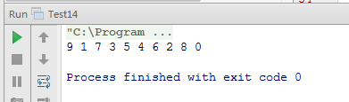

# 面试题 14：调整数组顺序使奇数位于偶数前面

##题目:输入一个整数数组，实现一个函数来调整该数组中数字的顺序，使得所有奇数位于数组的前半部分，所有偶数位予数组的后半部分。

这个题目要求把奇数放在数组的前半部分， 偶数放在数组的后半部分，因此所有的奇数应该位于偶数的前面。也就是说我们在扫描这个数组的时候， 如果发现有偶数出现在奇数的前面，我们可以交换它们的顺序，交换之后就符合要求了。

因此我们可以维护两个指针，第一个指针初始化时指向数组的第一个数字，它只向后移动：第二个指针初始化时指向数组的最后一个数字， 它只向前移动。在两个指针相遇之前，第一个指针总是位于第二个指针的前面。如果第一个指针指向的数字是偶数，并且第二个指针指向的数字是奇数，我们就交换这两个数字。

###代码实现：

```
public class Test14 {
    /**
     * 输入一个整数数组，实现一个函数来调整该数组中数字的顺序，
     * 使得所有奇数位于数组的前半部分，所有偶数位予数组的后半部分。
     *
     * @param arr 输入的数组
     */
    public static void reorderOddEven(int[] arr) {
        // 对于输入的数组为空，或者长度小于2的只接返回
        if (arr == null || arr.length < 2) {
            return;
        }
        // 从左向右记录偶数的位置
        int start = 0;
        // 从右向左记录奇数的位置
        int end = arr.length - 1;
        // 开始调整奇数和偶数的位置
        while (start < end) {
            // 找偶数
            while (start < end && arr[start] % 2 != 0) {
                start++;
            }
            // 找奇数
            while (start < end && arr[end] % 2 == 0) {
                end--;
            }
            // 找到后就将奇数和偶数交换位置
            // 对于start=end的情况，交换不会产生什么影响
            // 所以将if判断省去了
            int tmp = arr[start];
            arr[start] = arr[end];
            arr[end] = tmp;
        }
    }
    /**
     * 输出数组的信息
     *
     * @param arr 待输出数组
     */
    public static void printArray(int[] arr) {
        if (arr != null && arr.length > 0) {
            for (int i : arr) {
                System.out.print(i + " ");
            }
            System.out.println();
        }
    }
    public static void main(String[] args) {
        int[] array = {0, 1, 2, 3, 4, 5, 6, 7, 8, 9};
        reorderOddEven(array);
        printArray(array);
    }
}
```

###运行结果：
 
