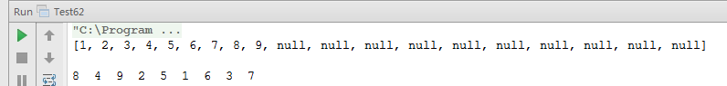

# 面试题 62：序列化二叉树

##题目：请实现两个函数，分别用来序列化和反序列化二叉树。

###解题思路

通过分析解决前面的面试题 6。我们知道可以从前序遍历和中序遍历构造出一棵二叉树。受此启发，我们可以先把一棵二叉树序列化成一个前序遍历序列和一个中序序列，然后再反序列化时通过这两个序列重构出原二叉树。 

这个思路有两个缺点。一个缺点是该方法要求二叉树中不能用有数值重复的结点。另外只有当两个序列中所有数据都读出后才能开始反序列化。如果两个遍历序列的数据是从一个流里读出来的，那就可能需要等较长的时间。 

实际上如果二叉树的序列化是从根结点开始的话，那么相应的反序列化在根结点的数值读出来的时候就可以开始了。因此我们可以根据前序遍历的顺序来序列化二叉树，因为前序遍历是从根结点开始的。当在遍历二叉树碰到 NULL 指针时，这些 NULL 指针序列化成一个特殊的字符（比如‘$’）。另外，结点的数值之间要用一个特殊字符（比如’,’）隔开。

###结点定义

```
private static class BinaryTreeNode {
    private int val;
    private BinaryTreeNode left;
    private BinaryTreeNode right;
    public BinaryTreeNode() {
    }
    public BinaryTreeNode(int val) {
        this.val = val;
    }
    @Override
    public String toString() {
        return val + "";
    }
}
```

###代码实现

```
import java.util.LinkedList;
import java.util.List;
public class Test62 {
    private static class BinaryTreeNode {
        private int val;
        private BinaryTreeNode left;
        private BinaryTreeNode right;
        public BinaryTreeNode() {
        }
        public BinaryTreeNode(int val) {
            this.val = val;
        }
        @Override
        public String toString() {
            return val + "";
        }
    }
    public static void serialize(BinaryTreeNode root, List<Integer> result) {
        List<BinaryTreeNode> list = new LinkedList<>();
        list.add(root);
        BinaryTreeNode node;
        while (list.size() > 0) {
            node = list.remove(0);
            if (node == null) {
                result.add(null);
            }else {
                result.add(node.val);
                list.add(node.left);
                list.add(node.right);
            }
        }
    }
    public static BinaryTreeNode deserialize(List<Integer> result, int idx) {
        if (result.size() < 1 || idx < 0 || result.size() <= idx || result.get(idx) == null) {
            return null;
        }
        BinaryTreeNode root = new BinaryTreeNode(result.get(idx));
        root.left = deserialize(result, idx * 2 + 1);
        root.right = deserialize(result, idx * 2 + 2);
        return root;
    }
    public static void main(String[] args) {
        test01();
    }
    private static void test01() {
        BinaryTreeNode n1 = new BinaryTreeNode(1);
        BinaryTreeNode n2 = new BinaryTreeNode(2);
        BinaryTreeNode n3 = new BinaryTreeNode(3);
        BinaryTreeNode n4 = new BinaryTreeNode(4);
        BinaryTreeNode n5 = new BinaryTreeNode(5);
        BinaryTreeNode n6 = new BinaryTreeNode(6);
        BinaryTreeNode n7 = new BinaryTreeNode(7);
        BinaryTreeNode n8 = new BinaryTreeNode(8);
        BinaryTreeNode n9 = new BinaryTreeNode(9);
        n1.left = n2;
        n1.right = n3;
        n2.left = n4;
        n2.right = n5;
        n3.left = n6;
        n3.right = n7;
        n4.left = n8;
        n4.right = n9;
        List<Integer> result = new LinkedList<>();
        serialize(n1, result);
        System.out.println(result);
        System.out.println();
        BinaryTreeNode root = deserialize(result, 0) ;
        print(root);
    }
    private static void print(BinaryTreeNode root) {
        if (root != null) {
            print(root.left);
            System.out.printf("%-3d", root.val);
            print(root.right);
        }
    }
}
```

###运行结果


