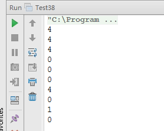

#面试题 38：数字在排序数组中出现的次数 

##题目：统计一个数字：在排序数组中出现的次数。

###举例说明

例如输入排序数组｛ 1, 2, 3, 3, 3, 3, 4, 5｝和数字 3 ，由于 3 在这个数组中出现了 4 次，因此输出 4 。

###解题思路

利用改进的二分算法。 

如何用二分查找算法在数组中找到第一个 k，二分查找算法总是先拿数组中间的数字和 k 作比较。如果中间的数字比 k 大，那么 k 只有可能出现在数组的前半段，下一轮我们只在数组的前半段查找就可以了。如果中间的数字比 k 小，那么 k 只有可能出现在数组的后半段，下一轮我们只在数组的后半乓查找就可以了。如果中间的数字和 k 相等呢？我们先判断这个数字是不是第一个 k。如果位于中间数字的前面一个数字不是 k,此时中间的数字刚好就是第一个 k。如果中间数字的前面一个数字也是 k，也就是说第一个 k 肯定在数组的前半段， 下一轮我们仍然需要在数组的前半段查找。 

同样的思路在排序数组中找到最后一个 k。如果中间数字比 k 大，那么 k 只能出现在数组的前半段。如果中间数字比 k 小，k 就只能出现在数组的后半段。如果中间数字等于 k 呢？我们需要判断这个 k 是不是最后一个 k，也就是中间数字的下一个数字是不是也等于 k。如果下一个数字不是 k，则中间数字就是最后一个 k 了，否则下一轮我们还是要在数组的后半段中去查找。

###代码实现

```
public class Test38 {
    /**
     * 找排序数组中k第一次出现的位置
     *
     * @param data
     * @param k
     * @param start
     * @param end
     * @return
     */
    private static int getFirstK(int[] data, int k, int start, int end) {
        if (data == null || data.length < 1 || start > end) {
            return -1;
        }
        int midIdx = start + (end - start) / 2;
        int midData = data[midIdx];
        if (midData == k) {
            if (midIdx > 0 && data[midIdx - 1] != k || midIdx == 0) {
                return midIdx;
            } else {
                end = midIdx - 1;
            }
        } else if (midData > k) {
            end = midIdx - 1;
        } else {
            start = midIdx + 1;
        }
        return getFirstK(data, k, start, end);
    }
    /**
     * 找排序数组中k最后一次出现的位置
     *
     * @param data
     * @param k
     * @param start
     * @param end
     * @return
     */
    private static int getLastK(int[] data, int k, int start, int end) {
        if (data == null || data.length < 1 || start > end) {
            return -1;
        }
        int midIdx = start + (end - start) / 2;
        int midData = data[midIdx];
        if (midData == k) {
            if (midIdx + 1 < data.length && data[midIdx + 1] != k || midIdx == data.length - 1) {
                return midIdx;
            } else {
                start = midIdx + 1;
            }
        } else if (midData < k) {
            start = midIdx + 1;
        } else {
            end = midIdx - 1;
        }
        return getLastK(data, k, start, end);
    }
    /**
     * 题目：统计一个数字：在排序数组中出现的次数
     * @param data
     * @param k
     * @return
     */
    public static int getNumberOfK(int[] data, int k) {
        int number = 0;
        if (data != null && data.length > 0) {
            int first = getFirstK(data, k, 0, data.length - 1);
            int last = getLastK(data, k, 0, data.length - 1);
            if (first > -1 && last > -1) {
                number = last - first + 1;
            }
        }
        return number;
    }
    public static void main(String[] args) {
        // 查找的数字出现在数组的中间
        int[] data1 = {1, 2, 3, 3, 3, 3, 4, 5};
        System.out.println(getNumberOfK(data1, 3)); // 4
        // 查找的数组出现在数组的开头
        int[] data2 = {3, 3, 3, 3, 4, 5};
        System.out.println(getNumberOfK(data2, 3)); // 4
        // 查找的数组出现在数组的结尾
        int[] data3 = {1, 2, 3, 3, 3, 3};
        System.out.println(getNumberOfK(data3, 3)); // 4
        // 查找的数字不存在
        int[] data4 = {1, 3, 3, 3, 3, 4, 5};
        System.out.println(getNumberOfK(data4, 2)); // 0
        // 查找的数字比第一个数字还小，不存在
        int[] data5 = {1, 3, 3, 3, 3, 4, 5};
        System.out.println(getNumberOfK(data5, 0)); // 0
        // 查找的数字比最后一个数字还大，不存在
        int[] data6 = {1, 3, 3, 3, 3, 4, 5};
        System.out.println(getNumberOfK(data6, 0)); // 0
        // 数组中的数字从头到尾都是查找的数字
        int[] data7 = {3, 3, 3, 3};
        System.out.println(getNumberOfK(data7, 3)); // 4
        // 数组中的数字从头到尾只有一个重复的数字，不是查找的数字
        int[] data8 = {3, 3, 3, 3};
        System.out.println(getNumberOfK(data8, 4)); // 0
        // 数组中只有一个数字，是查找的数字
        int[] data9 = {3};
        System.out.println(getNumberOfK(data9, 3)); // 1
        // 数组中只有一个数字，不是查找的数字
        int[] data10 = {3};
        System.out.println(getNumberOfK(data10, 4)); // 0
    }
}
```

###运行结果

