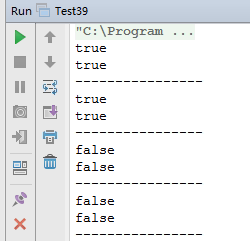

#面试题 39：二叉树的深度  

##题目一：输入一棵二叉树的根结点，求该树的深度。从根结点到叶子点依次经过的结点（含根、叶结点）形成树的一条路径，最长路径的长度为树的深度。

###二叉树的结点定义

```
private static class BinaryTreeNode {
    int val;
    BinaryTreeNode left;
    BinaryTreeNode right;
    public BinaryTreeNode() {
    }
    public BinaryTreeNode(int val) {
        this.val = val;
    }
}
```

###解题思路

如果一棵树只有一个结点，它的深度为。 如果根结点只有左子树而没有右子树， 那么树的深度应该是其左子树的深度加 1，同样如果根结点只有右子树而没有左子树，那么树的深度应该是其右子树的深度加 1。如果既有右子树又有左子树， 那该树的深度就是其左、右子树深度的较大值再加 1。 比如在图 6.1  的二叉树中，根结点为 1 的树有左右两个子树，其左右子树的根结点分别为结点 2 和 3。根结点为 2  的左子树的深度为 3， 而根结点为 3 的右子树的深度为 2，因此根结点为 1 的树的深度就是 4 。 

这个思路用递归的方法很容易实现， 只儒对遍历的代码稍作修改即可。


###代码实现

```
public static int treeDepth(BinaryTreeNode root) {
    if (root == null) {
        return 0;
    }
    int left = treeDepth(root.left);
    int right = treeDepth(root.right);
    return left > right ? (left + 1) : (right + 1);
}
```

##题目二：输入一棵二叉树的根结点，判断该树是不是平衡二叉树。如果某二叉树中任意结点的左右子树的深度相差不超过 1 ，那么它就是一棵平衡二叉树。

###解题思路

####解法一：需要重蟹遍历结点多次的解法 

在遍历树的每个结点的时候，调用函数 treeDepth 得到它的左右子树的深度。如果每个结点的左右子树的深度相差都不超过 1 ，按照定义它就是一棵平衡的二叉树。

```
public static boolean isBalanced(BinaryTreeNode root) {
    if (root == null) {
        return true;
    }
    int left = treeDepth(root.left);
    int right = treeDepth(root.right);
    int diff = left - right;
    if (diff > 1 || diff < -1) {
        return false;
    }
    return isBalanced(root.left) && isBalanced(root.right);
}
```

####解法二：每个结点只遍历一次的解法 

用后序遍历的方式遍历二叉树的每一个结点，在遍历到一个结点之前我们就已经遍历了它的左右子树。只要在遍历每个结点的时候记录它的深度（某一结点的深度等于它到叶节点的路径的长度），我们就可以一边遍历一边判断每个结点是不是平衡的。

```
/**
 * 判断是否是平衡二叉树，第二种解法
 *
 * @param root
 * @return
 */
public static boolean isBalanced2(BinaryTreeNode root) {
    int[] depth = new int[1];
    return isBalancedHelper(root, depth);
}
public static boolean isBalancedHelper(BinaryTreeNode root, int[] depth) {
    if (root == null) {
        depth[0] = 0;
        return true;
    }
    int[] left = new int[1];
    int[] right = new int[1];
    if (isBalancedHelper(root.left, left) && isBalancedHelper(root.right, right)) {
        int diff = left[0] - right[0];
        if (diff >= -1 && diff <= 1) {
            depth[0] = 1 + (left[0] > right[0] ? left[0] : right[0]);
            return true;
        }
    }
    return false;
}
```

###完整代码

```
public class Test39 {
    private static class BinaryTreeNode {
        int val;
        BinaryTreeNode left;
        BinaryTreeNode right;
        public BinaryTreeNode() {
        }
        public BinaryTreeNode(int val) {
            this.val = val;
        }
    }
    public static int treeDepth(BinaryTreeNode root) {
        if (root == null) {
            return 0;
        }
        int left = treeDepth(root.left);
        int right = treeDepth(root.right);
        return left > right ? (left + 1) : (right + 1);
    }
    /**
     * 判断是否是平衡二叉树，第一种解法
     *
     * @param root
     * @return
     */
    public static boolean isBalanced(BinaryTreeNode root) {
        if (root == null) {
            return true;
        }
        int left = treeDepth(root.left);
        int right = treeDepth(root.right);
        int diff = left - right;
        if (diff > 1 || diff < -1) {
            return false;
        }
        return isBalanced(root.left) && isBalanced(root.right);
    }
    /**
     * 判断是否是平衡二叉树，第二种解法
     *
     * @param root
     * @return
     */
    public static boolean isBalanced2(BinaryTreeNode root) {
        int[] depth = new int[1];
        return isBalancedHelper(root, depth);
    }
    public static boolean isBalancedHelper(BinaryTreeNode root, int[] depth) {
        if (root == null) {
            depth[0] = 0;
            return true;
        }
        int[] left = new int[1];
        int[] right = new int[1];
        if (isBalancedHelper(root.left, left) && isBalancedHelper(root.right, right)) {
            int diff = left[0] - right[0];
            if (diff >= -1 && diff <= 1) {
                depth[0] = 1 + (left[0] > right[0] ? left[0] : right[0]);
                return true;
            }
        }
        return false;
    }
    public static void main(String[] args) {
        test1();
        test2();
        test3();
        test4();
    }
    // 完全二叉树
    //             1
    //         /      \
    //        2        3
    //       /\       / \
    //      4  5     6   7
    private static void test1() {
        BinaryTreeNode n1 = new BinaryTreeNode(1);
        BinaryTreeNode n2 = new BinaryTreeNode(1);
        BinaryTreeNode n3 = new BinaryTreeNode(1);
        BinaryTreeNode n4 = new BinaryTreeNode(1);
        BinaryTreeNode n5 = new BinaryTreeNode(1);
        BinaryTreeNode n6 = new BinaryTreeNode(1);
        BinaryTreeNode n7 = new BinaryTreeNode(1);
        n1.left = n2;
        n1.right = n3;
        n2.left = n4;
        n2.right = n5;
        n3.left = n6;
        n3.right = n7;
        System.out.println(isBalanced(n1));
        System.out.println(isBalanced2(n1));
        System.out.println("----------------");
    }
    // 不是完全二叉树，但是平衡二叉树
    //             1
    //         /      \
    //        2        3
    //       /\         \
    //      4  5         6
    //        /
    //       7
    private static void test2() {
        BinaryTreeNode n1 = new BinaryTreeNode(1);
        BinaryTreeNode n2 = new BinaryTreeNode(1);
        BinaryTreeNode n3 = new BinaryTreeNode(1);
        BinaryTreeNode n4 = new BinaryTreeNode(1);
        BinaryTreeNode n5 = new BinaryTreeNode(1);
        BinaryTreeNode n6 = new BinaryTreeNode(1);
        BinaryTreeNode n7 = new BinaryTreeNode(1);
        n1.left = n2;
        n1.right = n3;
        n2.left = n4;
        n2.right = n5;
        n5.left = n7;
        n3.right = n6;
        System.out.println(isBalanced(n1));
        System.out.println(isBalanced2(n1));
        System.out.println("----------------");
    }
    // 不是平衡二叉树
    //             1
    //         /      \
    //        2        3
    //       /\
    //      4  5
    //        /
    //       7
    private static void test3() {
        BinaryTreeNode n1 = new BinaryTreeNode(1);
        BinaryTreeNode n2 = new BinaryTreeNode(1);
        BinaryTreeNode n3 = new BinaryTreeNode(1);
        BinaryTreeNode n4 = new BinaryTreeNode(1);
        BinaryTreeNode n5 = new BinaryTreeNode(1);
        BinaryTreeNode n6 = new BinaryTreeNode(1);
        BinaryTreeNode n7 = new BinaryTreeNode(1);
        n1.left = n2;
        n1.right = n3;
        n2.left = n4;
        n2.right = n5;
        n5.left = n7;
        System.out.println(isBalanced(n1));
        System.out.println(isBalanced2(n1));
        System.out.println("----------------");
    }
    //               1
    //              /
    //             2
    //            /
    //           3
    //          /
    //         4
    //        /
    //       5
    private static void test4() {
        BinaryTreeNode n1 = new BinaryTreeNode(1);
        BinaryTreeNode n2 = new BinaryTreeNode(1);
        BinaryTreeNode n3 = new BinaryTreeNode(1);
        BinaryTreeNode n4 = new BinaryTreeNode(1);
        BinaryTreeNode n5 = new BinaryTreeNode(1);
        BinaryTreeNode n6 = new BinaryTreeNode(1);
        BinaryTreeNode n7 = new BinaryTreeNode(1);
        n1.left = n2;
        n2.left = n3;
        n3.left = n4;
        n4.left = n5;
        System.out.println(isBalanced(n1));
        System.out.println(isBalanced2(n1));
        System.out.println("----------------");
    }
    // 1
    //  \
    //   2
    //    \
    //     3
    //      \
    //       4
    //        \
    //         5
    private static void test5() {
        BinaryTreeNode n1 = new BinaryTreeNode(1);
        BinaryTreeNode n2 = new BinaryTreeNode(1);
        BinaryTreeNode n3 = new BinaryTreeNode(1);
        BinaryTreeNode n4 = new BinaryTreeNode(1);
        BinaryTreeNode n5 = new BinaryTreeNode(1);
        BinaryTreeNode n6 = new BinaryTreeNode(1);
        BinaryTreeNode n7 = new BinaryTreeNode(1);
        n1.right = n2;
        n2.right = n3;
        n3.right = n4;
        n4.right = n5;
        System.out.println(isBalanced(n1));
        System.out.println(isBalanced2(n1));
        System.out.println("----------------");
    }
}
```

###运行结果

