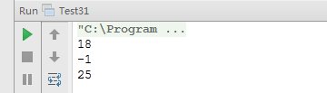

#面试题 31：连续子数组的最大和 

##题目：输入一个整型数组，数组里有正数也有负数。数组中一个或连续的多个整数组成一个子数组。求所有子数组的和的最大值。要求时间复杂度为 O(n)。

###例子说明：

例如输入的数组为{1, -2, 3, 10, -4, 7, 2, -5}，和最大的子数组为｛3, 10, -4, 7, 2}。因此输出为该子数组的和 18 。

###解题思路：

####解法一：举例分析数组的规律。

我们试着从头到尾逐个累加示例数组中的每个数字。初始化和为 0。第一步加上第一个数字 1， 此时和为 1。接下来第二步加上数字 -2，和就变成了 -1。第三步刷上数字3。我们注意到由于此前累计的和是 －1 ，小于 0，那如果用-1 加上 3 ，得到的和是 2 ， 比 3 本身还小。也就是说从第一个数字开始的子数组的和会小于从第三个数字开始的子数组的和。因此我们不用考虑从第一个数字开始的子数组，之前累计的和也被抛弃。

我们从第三个数字重新开始累加，此时得到的和是 3。接下来第四步加 10，得到和为 13 。第五步加上 -4， 和为 9。我们发现由于 -4 是一个负数，因此累加 -4 之后得到的和比原来的和还要小。因此我们要把之前得到的和 13 保存下来，它有可能是最大的子数组的和。第六步加上数字 7，9 加 7 的结果是 16，此时和比之前最大的和 13 还要大， 把最大的子数组的和由 13 更新为 16。第七步加上 2，累加得到的和为 18，同时我们也要更新最大子数组的和。第八步加上最后一个数字 -5，由于得到的和为 13 ，小于此前最大的和 18，因此最终最大的子数组的和为 18 ，对应的子数组是｛3, 10, -4, 7, 2｝。

####解法二： 应用动态归划法。

可以用动态规划的思想来分析这个问题。如果用函数 f(i)表示以第 i 个数字结尾的子数组的最大和，那么我们需要求出 max[f(i)]，其中 0 <= i < n。我们可用如下边归公式求 f(i):


这个公式的意义：当以第 i-1 个数字结尾的子数组中所有数字的和小于 0 时，如果把这个负数与第 i 个数累加，得到的结果比第 i 个数字本身还要小，所以这种情况下以第 i 个数字结尾的子数组就是第 i 个数字本身。如果以第 i-1 个数字结尾的子数组中所有数字的和大于 0，与第 i 个数字累加就得到以第 i 个数字结尾的子数组中所有数字的和。

本题采用第一种实现方式。

###代码实现：

```
public class Test31 {
    /**
     * 题目2 输入一个整型数组，数组里有正数也有负数。数组中一个或连
     * 续的多个整数组成一个子数组。求所有子数组的和的最大值。要求时间复杂度为O(n)。
     *
     * @param arr 输入数组
     * @return 最大的连续子数组和
     */
    public static int findGreatestSumOfSubArray(int[] arr) {
        // 参数校验
        if (arr == null || arr.length < 1) {
            throw new IllegalArgumentException("Array must contain an element");
        }
        // 记录最大的子数组和，开始时是最小的整数
        int max = Integer.MIN_VALUE;
        // 当前的和
        int curMax = 0;
        // 数组遍历
        for (int i : arr) {
            // 如果当前和小于等于0，就重新设置当前和
            if (curMax <= 0) {
                curMax = i;
            }
            // 如果当前和大于0，累加当前和
            else {
                curMax += i;
            }
            // 更新记录到的最在的子数组和
            if (max < curMax) {
                max = curMax;
            }
        }
        return max;
    }
    public static void main(String[] args) {
        int[] data = {1, -2, 3, 10, -4, 7, 2, -5};
        int[] data2 = {-2, -8, -1, -5, -9};
        int[] data3 = {2, 8, 1, 5, 9};
        System.out.println(findGreatestSumOfSubArray(data));
        System.out.println(findGreatestSumOfSubArray(data2));
        System.out.println(findGreatestSumOfSubArray(data3));
    }
}
```

###运行结果：

