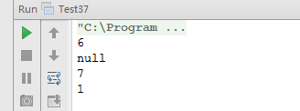

#面试题 37：两个链表的第一个公共结点  

##题目：输入两个链表，找出它们的第一个公共结点。

###链表结点定义

```
    /**
     * 链表结点类
     */
    private static class ListNode {
        int val;
        ListNode next;
        public ListNode() {
        }
        public ListNode(int val) {
            this.val = val;
        }
        @Override
        public String toString() {
            return val + "";
        }
    }
```

###解题思路：

####第一种：直接法 

在第一个链表上顺序遍历每个结点，每遍历到一个结点的时候，在第二个链表上顺序遍历每个结点。如果在第二个链表上有一个结点和第一个链表上的结点一样，说明两个链表在这个结点上重合，于是就找到了它们的公共结点。如果第一个链表的长度为 m，第二个链表的长度为 n，显然该方法的时间复杂度是 O(mn）。

###第二种：使用栈
 
所以两个有公共结点而部分重舍的链衰，拓扑形状看起来像一个 Y， 而不可能像 X（如图 5.3  所示）。


经过分析我们发现，如果两个链表有公共结点，那么公共结点出现在两个链表的尾部。如果我们从两个链衰的尾部开始往前比较，最后一个相同的结点就是我们要找的结点。 

在上述思路中，我们需要用两个辅助钱。如果链表的长度分别为 m 和 n，那么空间复杂度是 O(m+n）。这种思路的时间复杂度也是 O(m+n）。和最开始的蛮力法相比，时间效率得到了提高，相当于是用空间消耗换取了时间效率。

####第三种：先行法 

在图 5.3 的两个链表中，我们可以先遍历一次得到它们的长度分别为 5 和 4， 也就是较长的链表与较短的链表相比多一个结点。第二次先在长的链表上走 1 步，到达结点 2。接下来分别从结点 2 和结点 4 出发同时遍历两个结点， 直到找到它们第一个相同的结点 6，这就是我们想要的结果。
 
第三种思路和第二种思路相比，时间复杂度都是 O(m＋n)， 但我们不再需要辅助的拢，因此提高了空间效率。

本题采用第三种解法。

###代码实现

```
public class Test37 {
    /**
     * 链表结点类
     */
    private static class ListNode {
        int val;
        ListNode next;
        public ListNode() {
        }
        public ListNode(int val) {
            this.val = val;
        }
        @Override
        public String toString() {
            return val + "";
        }
    }
    /**
     * 找两个结点的第一个公共结点，如果没有找到返回null，方法比较好，考虑了两个链表中有null的情况
     *
     * @param head1 第一个链表
     * @param head2 第二个链表
     * @return 找到的公共结点，没有返回null
     */
    public static ListNode findFirstCommonNode(ListNode head1, ListNode head2) {
        int length1 = getListLength(head1);
        int length2 = getListLength(head2);
        int diff = length1 - length2;
        ListNode longListHead = head1;
        ListNode shortListHead = head2;
        if (diff < 0) {
            longListHead = head2;
            shortListHead = head1;
            diff = length2 - length1;
        }
        for (int i = 0; i < diff; i++) {
            longListHead = longListHead.next;
        }
        while (longListHead != null && shortListHead != null && longListHead != shortListHead) {
            longListHead = longListHead.next;
            shortListHead = shortListHead.next;
        }
        // 返回第一个相同的公共结点，如果没有返回null
        return longListHead;
    }
    private static int getListLength(ListNode head) {
        int result = 0;
        while (head != null) {
            result++;
            head = head.next;
        }
        return result;
    }
    public static void main(String[] args) {
        test1();
        test2();
        test3();
        test4();
    }
    private static void test1() {
        // 第一个公共结点在链表中间
        // 1 - 2 - 3 \
        //            6 - 7
        //     4 - 5 /
        ListNode n1 = new ListNode(1);
        ListNode n2 = new ListNode(2);
        ListNode n3 = new ListNode(3);
        ListNode n4 = new ListNode(4);
        ListNode n5 = new ListNode(5);
        ListNode n6 = new ListNode(6);
        ListNode n7 = new ListNode(7);
        n1.next = n2;
        n2.next = n3;
        n3.next = n6;
        n6.next = n7;
        n4.next = n5;
        n5.next = n6;
        System.out.println(findFirstCommonNode(n1, n4)); // 6
    }
    private static void test2() {
        // 没有公共结点
        // 1 - 2 - 3 - 4
        //
        // 5 - 6 - 7
        ListNode n1 = new ListNode(1);
        ListNode n2 = new ListNode(2);
        ListNode n3 = new ListNode(3);
        ListNode n4 = new ListNode(4);
        ListNode n5 = new ListNode(5);
        ListNode n6 = new ListNode(6);
        ListNode n7 = new ListNode(7);
        n1.next = n2;
        n2.next = n3;
        n3.next = n4;
        n5.next = n6;
        n6.next = n7;
        System.out.println(findFirstCommonNode(n1, n5)); // null
    }
    private static void test3() {
        // 公共结点是最后一个结点
        // 1 - 2 - 3 - 4 \
        //                7
        //         5 - 6 /
        ListNode n1 = new ListNode(1);
        ListNode n2 = new ListNode(2);
        ListNode n3 = new ListNode(3);
        ListNode n4 = new ListNode(4);
        ListNode n5 = new ListNode(5);
        ListNode n6 = new ListNode(6);
        ListNode n7 = new ListNode(7);
        n1.next = n2;
        n2.next = n3;
        n3.next = n4;
        n4.next = n7;
        n5.next = n6;
        n6.next = n7;
        System.out.println(findFirstCommonNode(n1, n5)); // 7
    }
    private static void test4() {
        // 公共结点是第一个结点
        // 1 - 2 - 3 - 4 - 5
        // 两个链表完全重合
        ListNode n1 = new ListNode(1);
        ListNode n2 = new ListNode(2);
        ListNode n3 = new ListNode(3);
        ListNode n4 = new ListNode(4);
        ListNode n5 = new ListNode(5);
        ListNode n6 = new ListNode(6);
        ListNode n7 = new ListNode(7);
        n1.next = n2;
        n2.next = n3;
        n3.next = n4;
        n4.next = n5;
        System.out.println(findFirstCommonNode(n1, n1)); // 1
    }
}
```

###运行结果


