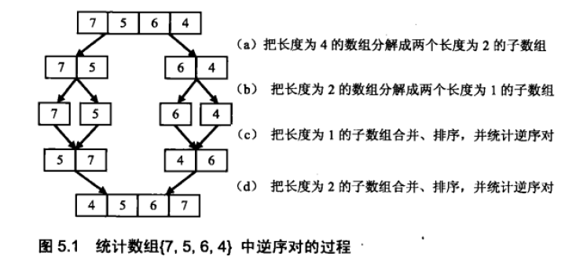
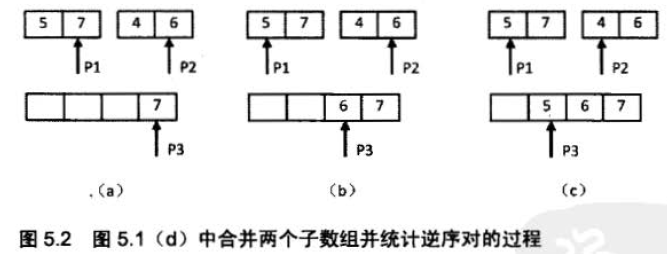
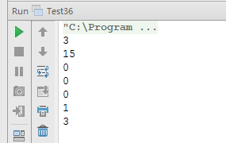

#面试题 36：数组中的逆序对 
 
##题目：在数组中的两个数字如果前面一个数字大于后面的数字，则这两个数字组成一个逆序对。输入一个数组，求出这个数组中的逆序对的总数。

###举例分析

例如在数组｛7, 5, 6, 4}中， 一共存在 5 个逆序对，分别是（7, 6）、（7，5），(7, 4）、（6, 4）和（5, 4）。

###解题思路：

####第一种：直接求解

顺序扫描整个数组。每扫描到一个数字的时候，逐个比较该数字和它后面的数字的大小。如果后面的数字比它小，则这两个数字就组成了一个逆序对。假设数组中含有 n 个数字。由于每个数字都要和 O(n）个数字作比较， 因此这个算法的时间复杂度是 O(n^2)。

####第二种：分析法

我们以数组｛7, 5, 6, 4｝为例来分析统计逆序对的过程。每次扫描到一个数字的时候，我们不能拿它和后面的每一个数字作比较，否则时间复杂度就是 O(n^5)，因此我们可以考虑先比较两个相邻的数字。



如图 5.1 ( a )和图 5.1 ( b）所示，我们先把数组分解成两个长度为 2 的子数组， 再把这两个子数组分别拆分成两个长度为 1 的子数组。接下来一边合并相邻的子数组， 一边统计逆序对的数目。在第一对长度为 1 的子数组｛7｝、｛5｝中7 大于 5 ， 因此（7, 5）组成一个逆序对。同样在第二对长度为 1 的子数组｛6｝、｛4｝中也有逆序对（6, 4）。由于我们已经统计了这两对子数组内部的逆序对，因此需要把这两对子数组排序（ 图 5.1 ( c）所示），以免在以后的统计过程中再重复统计。



注：图中省略了最后一步， 即复制第二个子数组最后剩余的 4 到辅助数组中。


- (a) P1 指向的数字大于 P2指向的数字，表明数组中存在逆序对。P2 指向的数字是第二个子数组的第二个数字， 因此第二个子数组中有两个数字比 7 小． 把逆序对数目加 2，并把 7 复制到辅助数组，向前移动 P1 和 P3。
- (b) P1 指向的数字小子 P2 指向的数字，没有逆序对。把 P2 指向的数字复制到辅助数组，并向前移动 P2 和 P3 。
- (c) P1 指向的数字大于 P2 指向的数字，因此存在逆序对。由于 P2 指向的数字是第二个子数组的第一个数字，子数组中只有一个数字比 5 小． 把逆序对数目加 1，并把 5 复制到辅助数组，向前移动 P1 和 P3。

接下来我们统计两个长度为 2 的子数组之间的逆序对。我们在图 5.2 中细分图 5.1 ( d）的合并子数组及统计逆序对的过程。 

我们先用两个指针分别指向两个子数组的末尾，并每次比较两个指针指向的数字。如果第一个子数组中的数字大于第二个子数组中的数字，则构成逆序对，并且逆序对的数目等于第二个子数组中剩余数字的个数（如图 5.2 (a)和图 5.2 (c)所示）。如果第一个数组中的数字小于或等于第二个数组中的数字，则不构成逆序对（如图 5.2 (b)所示〉。每一次比较的时候，我们都把较大的数字从·后往前复制到一个辅助数组中去，确保辅助数组中的数字是递增排序的。在把较大的数字复制到辅助数组之后，把对应的指针向前移动一位，接下来进行下一轮比较。 

经过前面详细的诗论， 我们可以总结出统计逆序对的过程：先把数组分隔成子数组， 先统计出子数组内部的逆序对的数目，然后再统计出两个相邻子数组之间的逆序对的数目。在统计逆序对的过程中，还需要对数组进行排序。如果对排序贺，法很熟悉，我们不难发现这个排序的过程实际上就是归并排序。

###代码实现：

```
public class Test36 {
    public static int inversePairs(int[] data) {
        if (data == null || data.length < 1) {
            throw new IllegalArgumentException("Array arg should contain at least a value");
        }
        int[] copy = new int[data.length];
        System.arraycopy(data, 0, copy, 0, data.length);
        return inversePairsCore(data, copy, 0, data.length - 1);
    }
    private static int inversePairsCore(int[] data, int[] copy, int start, int end) {
        if (start == end) {
            copy[start] = data[start];
            return 0;
        }
        int length = (end - start) / 2;
        int left = inversePairsCore(copy, data, start, start + length);
        int right = inversePairsCore(copy, data, start + length + 1, end);
        // 前半段的最后一个数字的下标
        int i = start + length;
        // 后半段最后一个数字的下标
        int j = end;
        // 开始拷贝的位置
        int indexCopy = end;
        // 逆序数
        int count = 0;
        while (i >= start && j >= start + length + 1) {
            if (data[i] > data[j]) {
                copy[indexCopy] = data[i];
                indexCopy--;
                i--;
                count += j - (start + length); // 对应的逆序数
            } else {
                copy[indexCopy] = data[j];
                indexCopy--;
                j--;
            }
        }
        for (; i >= start; i--) {
            copy[indexCopy] = data[i];
            indexCopy--;
            i--;
        }
        for (; j >= start + length + 1; j--) {
            copy[indexCopy] = data[j];
            indexCopy--;
            j--;
        }
        return count + left + right;
    }
    public static void main(String[] args) {
        int[] data = {1, 2, 3, 4, 7, 6, 5};
        System.out.println(inversePairs(data)); // 3
        int[] data2 = {6, 5, 4, 3, 2, 1};
        System.out.println(inversePairs(data2)); //  15
        int[] data3 = {1, 2, 3, 4, 5, 6};
        System.out.println(inversePairs(data3)); // 0
        int[] data4 = {1};
        System.out.println(inversePairs(data4)); // 0
        int[] data5 = {1, 2};
        System.out.println(inversePairs(data5)); // 0
        int[] data6 = {2, 1};
        System.out.println(inversePairs(data6)); // 1
        int[] data7 = {1, 2, 1, 2, 1};
        System.out.println(inversePairs(data7)); // 3
    }
}
```

###运行结果：

