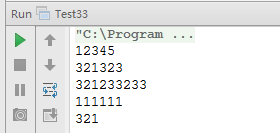

#面试题 33：把数组排成最小的数

##题目：输入一个正整数数组，把数组里所有数字拼接起来排成一个数，打印能拼接出的所有数字中最小的一个。

###例子说明：

例如输入数组{3， 32, 321}，则扫描输出这 3 个数字能排成的最小数字 321323。

###解题思路：

####第一种：直观解法

先求出这个数组中所有数字的全排列，然后把每个排列拼起来，最后求出拼起来的数字的最大值。

####第二种：排序解法

找到一个排序规则，数组根据这个规则排序之后能排成一个最小的数字。要确定排序规则，就要比较两个数字，也就是给出两个数字 m 和 n，我们需要确定一个规则判断 m 和 n 哪个应该排在前面，而不是仅仅比较这两个数字的值哪个更大。

根据题目的要求，两个数字 m 和 n 能拼接成数字 m 和 m。如果 mn < nm，那么我们应该打印出 m，也就是 m 应该排在 n 的前面，我们定义此时 m 小于 n：反之，如果 nm < mn，我们定义 n 小于 m。如果 mn=nm，m 等于 n。在下文中，符号“<”、“>”及“＝”表示常规意义的数值的大小关系，而文字“大于”、“小于”、“等于”表示我们新定义的大小关系。

接下来考虑怎么去拼接数字，即给出数字 m 和 n，怎么得到数字 m 和 m 并比较它们的大小。直接用数值去计算不难办到，但需要考虑到一个潜在的问题就是 m 和n 都在 int 能表达的范围内，但把它们拼起来的数字 m 和 m 用 int 表示就有可能溢出了，所以这还是一个隐形的大数问题。

一个非常直观的解决大数问题的方法就是把数字转换成字符串。另外，由于把数字 m 和 n 拼接起来得到 m 和 m，它们的位数肯定是相同的，因此比较它们的大小只需要按照字符串大小的比较规则就可以了。

本题采用第二种方法实现。

###代码实现：

```
public class Test33 {
    /**
     * 自定义的排序比较器，实现算法说明的排序原理
     */
    private static class MComparator implements Comparator<String> {
        @Override
        public int compare(String o1, String o2) {
            if (o1 == null || o2 == null) {
                throw new IllegalArgumentException("Arg should not be null");
            }
            String s1 = o1 + o2;
            String s2 = o2 + o1;
            return s1.compareTo(s2);
        }
    }
    /**
     * 快速排序算法
     *
     * @param array      待排序数组
     * @param start      要排序的起始位置
     * @param end        要排序的结束位置
     * @param comparator 自定义的比较器
     */
    private static void quickSort(String[] array, int start, int end, Comparator<String> comparator) {
        if (start < end) {
            String pivot = array[start];
            int left = start;
            int right = end;
            while (start < end) {
                while (start < end && comparator.compare(array[end], pivot) >= 0) {
                    end--;
                }
                array[start] = array[end];
                while (start < end && comparator.compare(array[start], pivot) <= 0) {
                    start++;
                }
                array[end] = array[start];
            }
            array[start] = pivot;
            quickSort(array, left, start - 1, comparator);
            quickSort(array, start + 1, end, comparator);
        }
    }
    /**
     * 题目：输入一个正整数数组，把数组里所有数字拼接起来排成一个数，
     * 打印能拼接出的所有数字中最小的一个。
     * @param array 输入的数组
     * @return 输出结果
     */
    public static String printMinNumber(String[] array) {
        if (array == null || array.length < 1) {
            throw new IllegalArgumentException("Array must contain value");
        }
        MComparator comparator = new MComparator();
        quickSort(array, 0, array.length - 1, comparator);
        StringBuilder builder = new StringBuilder(256);
        for (String s : array) {
            builder.append(s);
        }
        return builder.toString();
    }
    public static void main(String[] args) {
        String[] data = {"3", "5", "1", "4", "2"};
        System.out.println(printMinNumber(data));
        String[] data2 = {"3", "32", "321"};
        System.out.println(printMinNumber(data2));
        String[] data3 = {"3", "323", "32123"};
        System.out.println(printMinNumber(data3));
        String[] data4 = {"1", "11", "111"};
        System.out.println(printMinNumber(data4));
        String[] data5 = {"321"};
        System.out.println(printMinNumber(data5));
    }
}
```

###运行结果：

