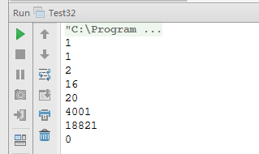

# 求从 1 到 n 的整数中 1 出现的次数  

## 题目：输入一个整数 n 求从 1 到 n 这 n 个整数的十进制表示中 1 出现的次数。

### 举例说明：

例如输入 12 ，从 1 到 12 这些整数中包含 1 的数字有 1、10、11 和 12，1 一共出现了 5 次。

### 题解思路：

#### 第一种：不夸虑时间效率的解法

累加 1 到 n 中每个整数 1 出现的次数。我们可以每次通过对 10 求余数判断整数的个位数字是不是 1。如果这个数字大于 10，除以 10 之后再判断个位数字是不是 1 。

### 第二种：从数字规律着手明显提高时间效率的解法

21345 作为例子来分析。我们把从 1 到 21345 的所有数字分为两段， 一段是从 1 到1345，另一段是从 1346 到 21345。

我们先看从 1346 到 21345 中 1 出现的次数。1 的出现分为两种情况。首先分析1出现在最高位（本例中是万位）的情况。从 1346 到 21345 的数字中， 1 出现在 10000～19999 这 10000 个数字的万位中， 一共出现了 10000(10^4)个。

值得注意的是， 并不是对所有 5 位数而言在万位出现的次数都是 10000 个。对于万位是 1 的数字比如输入 12345，1 只出现在 10000～12345 的万位，出现的次数不是 10^4 次，而是 2346 次，也就是除去最高数字之后剩下的数字再加上 1（即2345+1=2346 次）。

接下来分析 1 出现在除最高位之外的其他四位数中的情况。例子中 1346～21345 这 20000 个数字中后 4 位中 1 出现的次数是 2000 次。由于最 
高位是 2，我们可以再把 1346～21345 分成两段， 1346～11345 和 1346～21345 。每一段剩下的 4 位数字中， 选择其中一位是 1 ，其余三位可以在 0～9 这 10 个数字中任意选择，因此根据排列组合原则，总共出现的次数是 2*10^3=2000。

至于从 l 到 1345 中 1 出现的次数，我们就可以用递归求得了。这也是我们为什么要把 1～21345 分成 1～ 1345 和 1346～21345 两段的原因。因为把 21345 的最高位去掉就变成 1345 ，便于我们采用递归的思路。

本题采用第二种解法。

### 代码实现：

```
public class Test32 {
    /**
     * 题目：输入一个整数n求从1 到n这n个整数的十进制表示中1 出现的次数。
     * @param n 最大的数字
     * @return 1-n中，各个数位1出现的次数
     */
    public static int numberOf1Between1AndN(int n) {
        if (n <= 0) {
            return 0;
        }
        String value = n + "";
        int[] numbers = new int[value.length()];
        for (int i = 0; i < numbers.length; i++) {
            numbers[i] = value.charAt(i) - '0';
        }
        return numberOf1(numbers, 0);
    }
    /**
     * 求0-numbers表的数字中的1的个数
     *
     * @param numbers 数字，如{1, 2, 3, 4, 5}表示数字12345
     * @param curIdx  当前处理的位置
     * @return 1的个数
     */
    private static int numberOf1(int[] numbers, int curIdx) {
        if (numbers == null || curIdx >= numbers.length || curIdx < 0) {
            return 0;
        }
        // 待处理的第一个数字
        int first = numbers[curIdx];
        // 要处理的数字的位数
        int length = numbers.length - curIdx;
        // 如果只有一位且这一位是0返回0
        if (length == 1 && first == 0) {
            return 0;
        }
        // 如果只有一位且这一位不是0返回1
        if (length == 1 && first > 0) {
            return 1;
        }
        // 假设numbers是21345
        // numFirstDigit是数字10000-19999的第一个位中的数目
        int numFirstDigit = 0;
        // 如果最高位不是1，如21345，在[1236, 21345]中，最高位1出现的只在[10000, 19999]中，出现1的次数是10^4方个
        if (first > 1) {
            numFirstDigit = powerBase10(length - 1);
        }
        // 如果最高位是1，如12345，在[2346, 12345]中，最高位1出现的只在[10000, 12345]中，总计2345+1个
        else if (first == 1) {
            numFirstDigit = atoi(numbers, curIdx + 1) + 1;
        }
        // numOtherDigits，是[1346, 21345]中，除了第一位之外（不看21345中的第一位2）的数位中的1的数目
        int numOtherDigits = first * (length - 1) * powerBase10(length - 2);
        // numRecursive是1-1234中1的的数目
        int numRecursive = numberOf1(numbers, curIdx + 1);
        return numFirstDigit + numOtherDigits + numRecursive;
    }
    /**
     * 将数字数组转换成数值，如{1, 2, 3, 4, 5}，i = 2，结果是345
     * @param numbers 数组
     * @param i 开始黑气的位置
     * @return 转换结果
     */
    private static int atoi(int[] numbers, int i) {
        int result = 0;
        for (int j = i; j < numbers.length; j++) {
            result = (result * 10 + numbers[j]);
        }
        return result;
    }
    /**
     * 求10的n次方，假定n不为负数
     * @param n 幂，非负数
     * @return 10的n次方
     */
    private static int powerBase10(int n) {
        int result = 1;
        for (int i = 0; i < n; i++) {
            result *= 10;
        }
        return result;
    }
    public static void main(String[] args) {
        System.out.println(numberOf1Between1AndN(1)); // 1
        System.out.println(numberOf1Between1AndN(5)); // 1
        System.out.println(numberOf1Between1AndN(10)); // 2
        System.out.println(numberOf1Between1AndN(55)); // 16
        System.out.println(numberOf1Between1AndN(99)); // 20
        System.out.println(numberOf1Between1AndN(10000)); // 4001
        System.out.println(numberOf1Between1AndN(21345)); // 18821
        System.out.println(numberOf1Between1AndN(0)); // 0
    }
}
```

### 运行结果：


