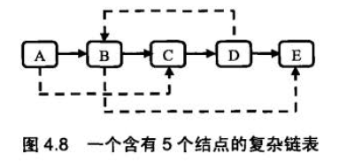
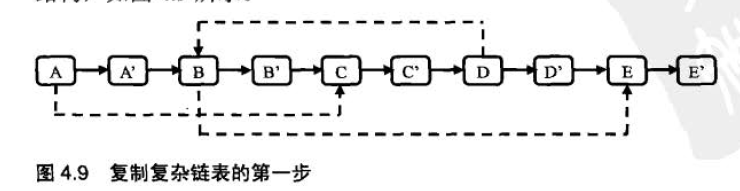
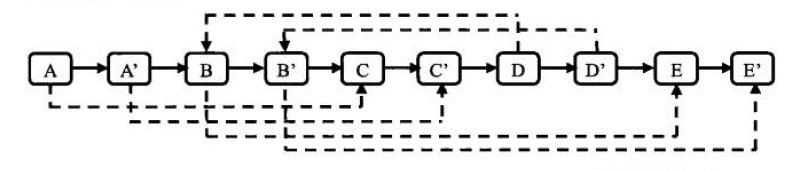
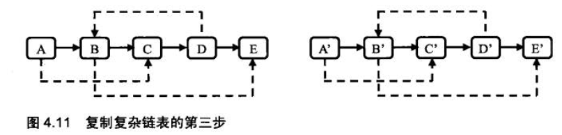

# 复杂链表的复制  

## 题目：请实现函数 ComplexListNode clone(ComplexListNode head)，复制一个复杂链表。在复杂链表中，每个结点除了有一个 next 域指向下一个结点外，还有一个 sibling 指向链表中的任意结点或者 null。

### 结点结构定义：

```
public static class ComplexListNode {
    int value;
    ComplexListNode next;
    ComplexListNode sibling;
}
```

### 解题思路：

图 4.8 是一个含有 5 个结点的复杂链表。图中实线箭头表示 next 指针，虚线箭头表示 sibling 指针。为简单起见，指向 null 的指针没有画出。



在不用辅助空间的情况下实现 O(n)的时间效率。

第一步：仍然是根据原始链表的每个结点N 创建对应的 N’。把 N’链接在N的后面。图 4.8 的链表经过这一步之后的结构，如图 4.9 所示。



第二步：设置复制出来的结点的 sibling。假设原始链表上的 N 的 sibling 指向结点 S，那么其对应复制出来的 N’是 N的 pext 指向的结点，同样 S’也是 S 的 next 指向的结点。设置 sibling 之后的链表如图 4.10 所示。



第三步：把这个长链表拆分成两个链表。把奇数位置的结点用 next 链接起来就是原始链表，把偶数位置的结点用 next 链接起来就是复制 出来的链表。图 4.10 中的链表拆分之后的两个链表如图 4.11 所示。



### 代码实现：

```
public class Test26 {
    /**
     * 复杂链表结点
     */
    public static class ComplexListNode {
        int value;
        ComplexListNode next;
        ComplexListNode sibling;
    }
    /**
     * 实现函复制一个复杂链表。在复杂链表中，每个结点除了有一个next字段指向下一个结点外，
     * 还有一个sibling字段指向链表中的任意结点或者NULL
     *
     * @param head 链表表头结点
     * @return 复制结点的头结点
     */
    public static ComplexListNode clone(ComplexListNode head) {
        // 如果链表为空就直接返回空
        if (head == null) {
            return null;
        }
        // 先复制结点
        cloneNodes(head);
        // 再链接sibling字段
        connectNodes(head);
        // 将整个链表拆分，返回复制链表的头结点
        return reconnectNodes(head);
    }
    /**
     * 复制一个链表，并且将复制后的结点插入到被复制的结点后面，只链接复制结点的next字段
     *
     * @param head 待复制链表的头结点
     */
    public static void cloneNodes(ComplexListNode head) {
        // 如果链表不空，进行复制操作
        while (head != null) {
            // 创建一个新的结点
            ComplexListNode tmp = new ComplexListNode();
            // 将被复制结点的值传给复制结点
//            tmp.value = head.value;
            ///////////////////////////////////////////////////////////////////////////////////////////
            // TODO 此处为了做测试，让复制结点的值都增加了100，如果不需要可以将下面一个行注释掉，打开上一行。
            tmp.value = head.value + 100;
            ///////////////////////////////////////////////////////////////////////////////////////////
            // 复制结点的next指向下一个要被复制的结点
            tmp.next = head.next;
            // 被复制结点的next指向复制结点
            head.next = tmp;
            // 到些处就已经完成了一个结点的复制并且插入到被复制结点的后面
            // heed指向下一个被复制结点的位置
            head = tmp.next;
        }
    }
    /**
     * 设置复制结点的sibling字段
     *
     * @param head 链表的头结
     */
    public static void connectNodes(ComplexListNode head) {
        // 如链表不为空
        while (head != null) {
            // 当前处理的结点sibling字段不为空，则要设置其复制结点的sibling字段
            if (head.sibling != null) {
                // 复制结点的sibling指向被复制结点的sibling字段的下一个结点
                // head.next：表求复制结点，
                // head.sibling：表示被复制结点的sibling所指向的结点，
                // 它的下一个结点就是它的复制结点
                head.next.sibling = head.sibling.next;
            }
            // 指向下一个要处理的复制结点
            head = head.next.next;
        }
    }
    /**
     * 刚复制结点和被复制结点拆开，还原被复制的链表，同时生成监制链表
     *
     * @param head 链表的头结点
     * @return 复制链表的头结点
     */
    public static ComplexListNode reconnectNodes(ComplexListNode head) {
        // 当链表为空就直接返回空
        if (head == null) {
            return null;
        }
        // 用于记录复制链表的头结点
        ComplexListNode newHead = head.next;
        // 用于记录当前处理的复制结点
        ComplexListNode pointer = newHead;
        // 被复制结点的next指向下一个被复制结点
        head.next = newHead.next;
        // 指向新的被复制结点
        head = head.next;
        while (head != null) {
            // pointer指向复制结点
            pointer.next = head.next;
            pointer = pointer.next;
            // head的下一个指向复制结点的下一个结点，即原来链表的结点
            head.next = pointer.next;
            // head指向下一个原来链表上的结点
            head = pointer.next;
        }
        // 返回复制链表的头结点
        return newHead;
    }
    /**
     * 输出链表信息
     *
     * @param head 链表头结点
     */
    public static void printList(ComplexListNode head) {
        while (head != null) {
            System.out.print(head.value + "->");
            head = head.next;
        }
        System.out.println("null");
    }
    /**
     * 判断两个链表是否是同一个链表，不是值相同
     *
     * @param h1 链表头1
     * @param h2 链表头2
     * @return true：两个链表是同一个链表，false：不是
     */
    public static boolean isSame(ComplexListNode h1, ComplexListNode h2) {
        while (h1 != null && h2 != null) {
            if (h1 == h2) {
                h1 = h1.next;
                h2 = h2.next;
            } else {
                return false;
            }
        }
        return h1 == null && h2 == null;
    }
    public static void main(String[] args) {
        //          -----------------
        //         \|/              |
        //  1-------2-------3-------4-------5
        //  |       |      /|\             /|\
        //  --------+--------               |
        //          -------------------------
        ComplexListNode head = new ComplexListNode();
        head.value = 1;
        head.next = new ComplexListNode();
        head.next.value = 2;
        head.next.next = new ComplexListNode();
        head.next.next.value = 3;
        head.next.next.next = new ComplexListNode();
        head.next.next.next.value = 4;
        head.next.next.next.next = new ComplexListNode();
        head.next.next.next.next.value = 5;
        head.sibling = head.next.next;
        head.next.sibling = head.next.next.next.next.next;
        head.next.next.next.sibling = head.next;
        ComplexListNode tmp = head;
        printList(head);
        ComplexListNode newHead = clone(head);
        printList(head);
        System.out.println(isSame(head, tmp));
        printList(newHead);
        System.out.println(isSame(head, newHead));
        // 有指向自身的情况
        //          -----------------
        //         \|/              |
        //  1-------2-------3-------4-------5
        //         |       | /|\           /|\
        //         |       | --             |
        //         |------------------------|
        ComplexListNode head2 = new ComplexListNode();
        head2.value = 1;
        head2.next = new ComplexListNode();
        head2.next.value = 2;
        head2.next.next = new ComplexListNode();
        head2.next.next.value = 3;
        head2.next.next.next = new ComplexListNode();
        head2.next.next.next.value = 4;
        head2.next.next.next.next = new ComplexListNode();
        head2.next.next.next.next.value = 5;
        head2.next.sibling = head2.next.next.next.next;
        head2.next.next.next.sibling = head2.next.sibling;
        head2.next.next.sibling = head2.next.next;
        System.out.println("\n");
        tmp = head2;
        printList(head2);
        ComplexListNode newHead2 = clone(head2);
        printList(head2);
        System.out.println(isSame(head2, tmp));
        printList(newHead2);
        System.out.println(isSame(head2, newHead2));
        ComplexListNode head3 = new ComplexListNode();
        head3.value = 1;
        System.out.println("\n");
        tmp = head3;
        printList(head3);
        ComplexListNode newHead3 = clone(head3);
        printList(head3);
        System.out.println(isSame(head3, tmp));
        printList(newHead3);
        System.out.println(isSame(head3, newHead3));
        System.out.println("\n");
        ComplexListNode head4 = clone(null);
        printList(head4);
    }
}
```

### 运行结果：

注意：划红线部分是为了区分原链表和复制链表，具体还原见代码注释。

